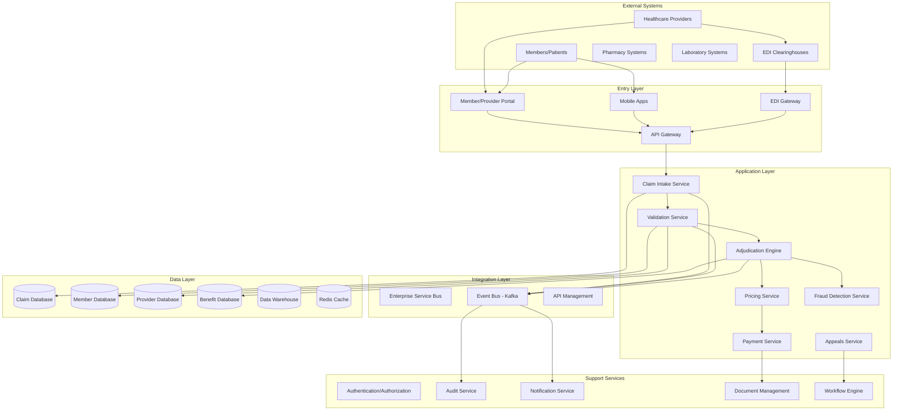

# Architecture Overview - Healthcare Claim Process

## Executive Summary

This document provides a comprehensive overview of the enterprise architecture for the healthcare payer claim processing system. The architecture is designed to handle millions of claims annually while ensuring HIPAA compliance, accuracy, and operational efficiency.

## Vision and Goals

### Strategic Vision
Create a modern, scalable, and secure claim processing platform that:
- Reduces claim processing time from days to minutes
- Minimizes manual intervention through intelligent automation
- Ensures 99.99% system availability
- Provides real-time visibility into claim status
- Supports regulatory compliance (HIPAA, ACA, state regulations)

### Business Goals
1. **Efficiency**: Process 95% of clean claims within 24 hours
2. **Accuracy**: Achieve 99.5% first-pass claim accuracy
3. **Cost Reduction**: Reduce operational costs by 30% through automation
4. **Member Satisfaction**: Improve member satisfaction scores by 25%
5. **Provider Experience**: Reduce provider inquiry calls by 40%

## Architecture Principles

### 1. Cloud-First
- Leverage cloud-native services for scalability and resilience
- Use managed services to reduce operational overhead
- Design for multi-region deployment

### 2. API-First
- All services expose RESTful APIs
- Standardized API contracts using OpenAPI 3.0
- API gateway for security and rate limiting

### 3. Event-Driven
- Asynchronous processing for scalability
- Event sourcing for audit and compliance
- Real-time notifications and updates

### 4. Microservices Architecture
- Domain-driven design with bounded contexts
- Independent deployment and scaling
- Service mesh for inter-service communication

### 5. Security by Design
- Zero-trust security model
- End-to-end encryption for PHI/PII
- Role-based access control (RBAC)
- Comprehensive audit logging

### 6. Data-Driven
- Real-time analytics and reporting
- Machine learning for fraud detection
- Predictive analytics for claim trends

## High-Level Architecture

## Architecture Layers

### 1. Entry Layer
**Purpose**: Provides multiple channels for claim submission and inquiry

**Components**:
- **API Gateway**: Kong/AWS API Gateway for unified API access
- **EDI Gateway**: Trading partner connectivity for X12 837 transactions
- **Web Portal**: Provider and member self-service portals
- **Mobile Apps**: iOS/Android apps for claim submission and status

**Key Features**:
- Rate limiting and throttling
- Authentication and authorization
- Protocol transformation
- Request/response logging

### 2. Application Layer
**Purpose**: Core business logic and claim processing services

**Key Services**:

#### Claim Intake Service
- Receives claims from all channels
- Assigns unique claim identifiers
- Initial claim registration
- Routes to appropriate processing queue

#### Validation Service
- Edits and validation (HIPAA 5010 compliance)
- Provider credentialing checks
- Member eligibility verification
- Benefit validation
- Prior authorization verification

#### Adjudication Engine
- Claims processing rules engine
- Benefit application
- Coverage determination
- Coordination of benefits (COB)
- Subrogation processing

#### Pricing Service
- Fee schedule application
- Contract pricing
- Bundling and unbundling
- Price transparency calculations

#### Payment Service
- Payment calculation
- Provider payment processing
- Member reimbursement
- EFT/check generation
- 835 remittance advice

#### Fraud Detection Service
- Real-time fraud scoring
- Pattern analysis
- Anomaly detection
- Provider behavior analysis

### 3. Integration Layer
**Purpose**: Enables communication between services and external systems

**Components**:
- **Event Bus (Apache Kafka)**: Asynchronous event-driven communication
- **ESB**: Legacy system integration
- **API Management**: API lifecycle management

### 4. Data Layer
**Purpose**: Persistent storage and data management

**Databases**:
- **Claim Database**: PostgreSQL for transactional claim data
- **Member Database**: PostgreSQL for member enrollment and demographics
- **Provider Database**: PostgreSQL for provider network and contracts
- **Benefit Database**: PostgreSQL for benefit plans and coverage rules
- **Data Warehouse**: Snowflake for analytics and reporting
- **Cache**: Redis for high-performance data access

### 5. Support Services
**Purpose**: Cross-cutting concerns and shared services

**Services**:
- **Authentication/Authorization**: OAuth 2.0/OIDC with Okta
- **Audit Service**: Comprehensive audit trail for compliance
- **Notification Service**: Multi-channel notifications (email, SMS, push)
- **Document Management**: Claim attachments and correspondence
- **Workflow Engine**: Camunda for complex business processes

## Technology Stack

### Application Platform
- **Runtime**: Java 17 (Spring Boot), Node.js, Python
- **Container Platform**: Kubernetes (EKS)
- **Service Mesh**: Istio
- **API Gateway**: Kong

### Data Platform
- **Relational DB**: PostgreSQL 14
- **Cache**: Redis 7.x
- **Message Broker**: Apache Kafka
- **Data Warehouse**: Snowflake
- **Search**: Elasticsearch

### Cloud Infrastructure (AWS)
- **Compute**: EKS, Lambda
- **Storage**: S3, EFS
- **Network**: VPC, CloudFront
- **Security**: KMS, Secrets Manager, WAF

### DevOps & Observability
- **CI/CD**: GitHub Actions, ArgoCD
- **Monitoring**: Datadog, CloudWatch
- **Logging**: ELK Stack
- **APM**: Datadog APM
- **Tracing**: Jaeger

## Non-Functional Requirements

### Performance
- **Claim Processing**: 1000 claims/second sustained throughput
- **API Response Time**: < 200ms for 95th percentile
- **Adjudication Time**: < 5 seconds for standard claims
- **Batch Processing**: 500,000 claims per hour

### Availability
- **System Uptime**: 99.99% (52 minutes downtime/year)
- **Recovery Time Objective (RTO)**: < 1 hour
- **Recovery Point Objective (RPO)**: < 5 minutes

### Scalability
- **Horizontal Scaling**: Auto-scaling based on load
- **Peak Load**: 10x normal volume during open enrollment
- **Data Volume**: 100M+ claims annually

### Security
- **Encryption**: AES-256 at rest, TLS 1.3 in transit
- **Compliance**: HIPAA, SOC 2, PCI-DSS (for payments)
- **Audit**: All PHI access logged and monitored
- **Authentication**: Multi-factor authentication (MFA)

## Architecture Decisions

### ADR-001: Cloud Platform Selection
- **Decision**: AWS as primary cloud provider
- **Rationale**: HIPAA compliance, mature services, multi-region support
- **Status**: Accepted

### ADR-002: Database Strategy
- **Decision**: PostgreSQL for transactional data, Snowflake for analytics
- **Rationale**: ACID compliance, performance, cost-effectiveness
- **Status**: Accepted

### ADR-003: Microservices vs Monolith
- **Decision**: Microservices architecture
- **Rationale**: Scalability, team autonomy, technology flexibility
- **Status**: Accepted

### ADR-004: Event-Driven Architecture
- **Decision**: Kafka for event streaming
- **Rationale**: High throughput, durability, event replay capability
- **Status**: Accepted

### ADR-005: API Standards
- **Decision**: REST/JSON with OpenAPI 3.0 specifications
- **Rationale**: Industry standard, tooling support, developer familiarity
- **Status**: Accepted

## Deployment Architecture

### Environments
1. **Development**: Developer workstations and dev cloud environment
2. **Integration**: Automated testing and integration
3. **UAT**: User acceptance testing
4. **Production**: Multi-region deployment (us-east-1, us-west-2)
5. **DR**: Disaster recovery site (us-west-2)

### Deployment Strategy
- Blue/Green deployments for zero-downtime updates
- Canary releases for gradual rollout
- Feature flags for controlled feature enablement
- Automated rollback on failure

## Risk Management

### Technical Risks
1. **Data Migration**: Risk of data loss during legacy system migration
   - Mitigation: Phased migration, extensive validation, rollback plans

2. **Performance**: Risk of not meeting throughput requirements
   - Mitigation: Load testing, performance monitoring, capacity planning

3. **Integration Complexity**: Multiple legacy system integrations
   - Mitigation: API abstraction layer, comprehensive testing

### Operational Risks
1. **Availability**: System downtime during peak periods
   - Mitigation: High availability architecture, auto-scaling, DR planning

2. **Security Breaches**: Unauthorized access to PHI
   - Mitigation: Zero-trust security, encryption, continuous monitoring

3. **Compliance Violations**: HIPAA audit findings
   - Mitigation: Security framework, regular audits, compliance automation

## Success Metrics

### Business Metrics
- Claim processing cycle time
- First-pass acceptance rate
- Provider satisfaction scores
- Member complaint rate
- Cost per claim processed

### Technical Metrics
- System availability (%)
- API response times
- Error rates
- Deployment frequency
- Mean time to recovery (MTTR)

### Compliance Metrics
- HIPAA audit findings
- Security incidents
- Audit log completeness
- Access control violations

## Future Roadmap

### Phase 1 (Current): Core Claim Processing
- Basic claim intake and adjudication
- Provider and member portals
- EDI integration

### Phase 2 (Q2 2026): Advanced Features
- Real-time benefit check
- Prior authorization automation
- Advanced fraud detection

### Phase 3 (Q4 2026): Analytics & AI
- Predictive analytics
- Claims forecasting
- Automated decision support

### Phase 4 (2027): Ecosystem Expansion
- Value-based care integration
- Population health management
- Provider collaboration platform

---
*Document Version: 1.0*
*Last Updated: January 2026*
*Owner: Enterprise Architecture Team*
