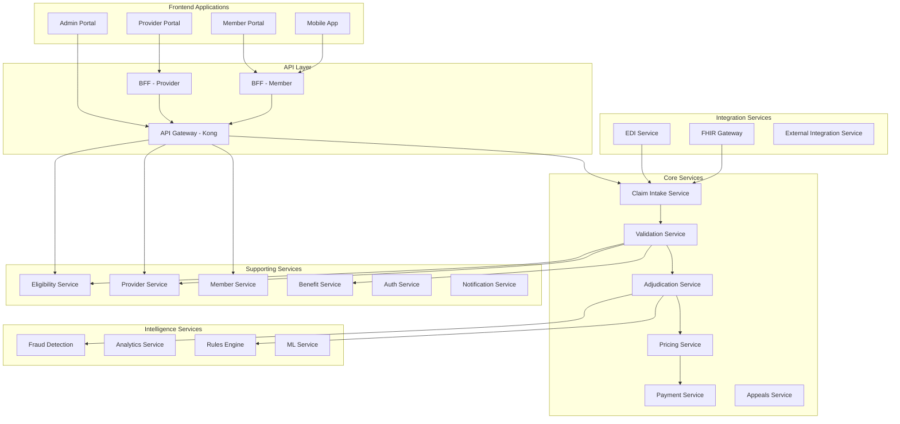
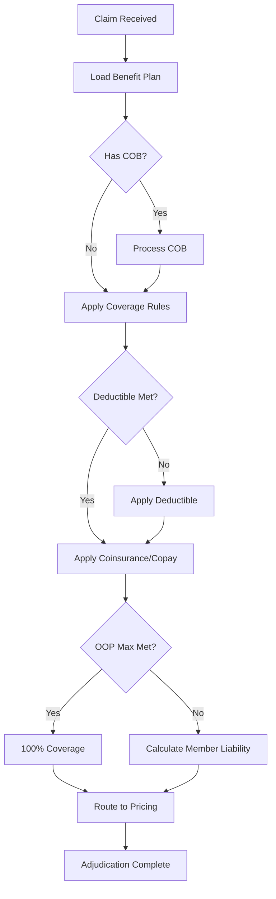
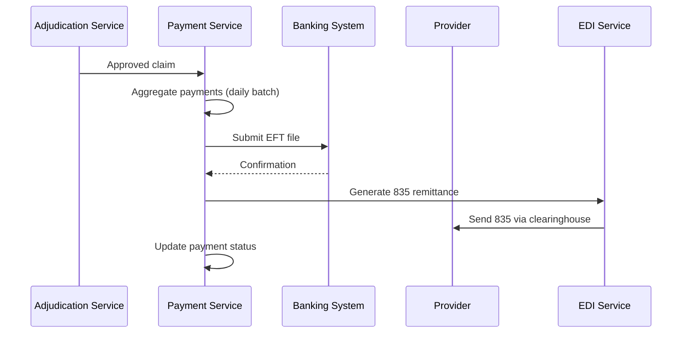

# System Components - Healthcare Claim Process

## Overview

This document provides detailed information about the technical components that comprise the healthcare claim processing system. Each component is designed as an independent microservice following domain-driven design principles.

## Component Architecture



## Core Services

### 1. Claim Intake Service

**Purpose**: Entry point for all claims, responsible for claim registration and initial routing.

**Responsibilities**:
- Accept claims from multiple channels (EDI, API, Portal, Mobile)
- Assign unique claim identifiers
- Normalize claim data into canonical format
- Persist raw claim data
- Route claims to validation queue
- Provide submission acknowledgments
- Handle claim attachments

**Technology Stack**:
- Runtime: Java 17, Spring Boot 3.x
- Database: PostgreSQL 14
- Message Queue: Kafka
- Object Storage: AWS S3 (attachments)

**API Endpoints**:
```
POST   /api/v1/claims              - Submit new claim
GET    /api/v1/claims/{id}         - Get claim details
GET    /api/v1/claims/{id}/status  - Get claim status
POST   /api/v1/claims/{id}/attachments - Upload attachment
GET    /api/v1/claims              - Search claims
```

**Key Interfaces**:
- **Input**: EDI 837 (P/I/D), JSON (API/Portal), FHIR (external)
- **Output**: Claim acknowledgment, Kafka events
- **Dependencies**: Kafka, S3, PostgreSQL

**Data Model**:
```json
{
  "claimId": "CLM-2026-00123456",
  "receivedDate": "2026-01-15T10:30:00Z",
  "submissionMethod": "PORTAL",
  "claimType": "PROFESSIONAL",
  "rawData": "...",
  "normalizedData": {...},
  "status": "RECEIVED",
  "attachments": [...]
}
```

**Scaling Strategy**:
- Horizontal pod autoscaling based on queue depth
- Read replicas for query operations
- S3 for attachment storage

### 2. Validation Service

**Purpose**: Validates claims against business rules, eligibility, and regulatory requirements.

**Responsibilities**:
- HIPAA 5010 compliance validation
- Eligibility verification
- Provider credentialing check
- Benefit coverage validation
- Duplicate claim detection
- Timely filing validation
- Coding validation (ICD-10, CPT, HCPCS)
- Prior authorization verification

**Technology Stack**:
- Runtime: Java 17, Spring Boot 3.x
- Rules Engine: Drools 8.x
- Database: PostgreSQL 14
- Cache: Redis 7.x

**Validation Rules Categories**:

1. **Format Validations**:
   - HIPAA transaction structure
   - Required field validation
   - Data type and length validation
   - Code set validation

2. **Business Validations**:
   - Member eligibility at DOS
   - Provider network status
   - Benefit plan coverage
   - Prior authorization requirement
   - Timely filing limits

3. **Clinical Validations**:
   - ICD-10 to CPT compatibility
   - Age/gender appropriateness
   - Diagnosis coding specificity
   - Procedure bundling rules

**API Endpoints**:
```
POST   /api/v1/validation/validate     - Validate claim
GET    /api/v1/validation/rules        - Get validation rules
POST   /api/v1/validation/rules/test   - Test validation rule
```

**Validation Response**:
```json
{
  "claimId": "CLM-2026-00123456",
  "validationStatus": "PASSED",
  "validationDate": "2026-01-15T10:31:00Z",
  "errors": [],
  "warnings": [
    {
      "code": "W001",
      "message": "Member approaching deductible limit",
      "severity": "WARNING"
    }
  ],
  "eligibility": {
    "eligible": true,
    "coverageEffectiveDate": "2026-01-01",
    "planId": "HMO-GOLD-001"
  }
}
```

**Performance Targets**:
- Validation time: < 2 seconds per claim
- Throughput: 500 validations/second
- Cache hit rate: > 90%

### 3. Adjudication Service

**Purpose**: Core claim processing engine that determines payment amounts.

**Responsibilities**:
- Apply benefit plan rules
- Calculate member liability (deductible, copay, coinsurance)
- Process coordination of benefits (COB)
- Handle subrogation
- Apply claim edits and downcoding
- Determine covered vs. non-covered services
- Route complex claims for manual review

**Technology Stack**:
- Runtime: Java 17, Spring Boot 3.x
- Rules Engine: Drools 8.x
- Database: PostgreSQL 14
- Cache: Redis 7.x

**Adjudication Logic Flow**:



**API Endpoints**:
```
POST   /api/v1/adjudication/process      - Process claim adjudication
POST   /api/v1/adjudication/recalculate  - Recalculate adjudication
GET    /api/v1/adjudication/{id}         - Get adjudication details
POST   /api/v1/adjudication/manual       - Submit for manual review
```

**Adjudication Result**:
```json
{
  "claimId": "CLM-2026-00123456",
  "adjudicationStatus": "APPROVED",
  "adjudicationDate": "2026-01-15T10:32:00Z",
  "totalBilled": 1500.00,
  "totalAllowed": 1200.00,
  "planPays": 960.00,
  "memberResponsibility": {
    "deductible": 100.00,
    "coinsurance": 140.00,
    "copay": 0.00,
    "total": 240.00
  },
  "accumulators": {
    "deductibleMet": 1200.00,
    "oopMet": 3400.00
  },
  "lineItems": [...]
}
```

**Performance Targets**:
- Auto-adjudication rate: > 85%
- Processing time: < 5 seconds
- Throughput: 1000 claims/second

### 4. Pricing Service

**Purpose**: Applies fee schedules and contract pricing to adjudicated claims.

**Responsibilities**:
- Apply fee schedules (Medicare, Medicaid, Commercial)
- Contract pricing lookup
- DRG (Diagnosis Related Group) pricing
- Per diem rates calculation
- Bundling and unbundling logic
- Outlier payment calculation
- Price transparency compliance

**Technology Stack**:
- Runtime: Java 17, Spring Boot 3.x
- Database: PostgreSQL 14
- Cache: Redis 7.x (fee schedules)

**Pricing Strategies**:

1. **Fee Schedule Pricing**:
   - Medicare Fee Schedule
   - State Medicaid rates
   - Custom fee schedules

2. **Contracted Rates**:
   - Provider-specific contracts
   - Facility contracts
   - Carved-out services

3. **DRG-based Pricing**:
   - MS-DRG for hospital claims
   - APR-DRG for severity adjustment

4. **Case Rate / Bundled Payments**:
   - Episode-based pricing
   - Bundled surgical packages

**API Endpoints**:
```
POST   /api/v1/pricing/calculate      - Calculate pricing
GET    /api/v1/pricing/fee-schedule   - Get fee schedule
POST   /api/v1/pricing/contract       - Apply contract pricing
GET    /api/v1/pricing/transparency   - Price transparency lookup
```

**Performance Targets**:
- Pricing calculation: < 1 second
- Fee schedule cache hit rate: > 95%

### 5. Payment Service

**Purpose**: Generates and processes payments to providers and members.

**Responsibilities**:
- Payment calculation and aggregation
- EFT (ACH) payment processing
- Check generation and printing
- 835 remittance advice generation
- Payment reconciliation
- Member reimbursement processing
- Overpayment recovery
- Payment status tracking

**Technology Stack**:
- Runtime: Java 17, Spring Boot 3.x
- Database: PostgreSQL 14
- Payment Gateway: Integration with banking systems
- Document Generation: Jasper Reports

**Payment Flow**:



**API Endpoints**:
```
POST   /api/v1/payments/create          - Create payment
GET    /api/v1/payments/{id}            - Get payment details
POST   /api/v1/payments/batch           - Process payment batch
GET    /api/v1/payments/remittance/{id} - Get remittance advice
POST   /api/v1/payments/recover         - Initiate recovery
```

**Payment Data Model**:
```json
{
  "paymentId": "PAY-2026-00789",
  "paymentDate": "2026-01-20",
  "paymentMethod": "EFT",
  "payeeType": "PROVIDER",
  "payeeId": "PRV-12345",
  "totalAmount": 15420.50,
  "claimCount": 47,
  "claims": [...],
  "eftDetails": {
    "routingNumber": "***",
    "accountNumber": "***",
    "traceNumber": "TRC-2026-00123"
  },
  "remittanceAdvice": {
    "edi835Id": "RA-2026-00456",
    "sentDate": "2026-01-20T14:00:00Z"
  }
}
```

**Performance Targets**:
- Payment processing: < 30 seconds per batch
- Average days to payment: < 18 days
- Payment accuracy: > 99%

### 6. Appeals Service

**Purpose**: Manages the appeals and grievances process for denied or underpaid claims.

**Responsibilities**:
- Accept appeal submissions
- Track appeal status and deadlines
- Route appeals to appropriate reviewers
- Support multi-level appeal process
- Generate appeal determination letters
- Escalate to external review
- Track appeal outcomes and trends

**Technology Stack**:
- Runtime: Java 17, Spring Boot 3.x
- Workflow Engine: Camunda 7.x
- Database: PostgreSQL 14
- Document Management: AWS S3

**Appeal Levels**:

1. **Level 1 - Internal Review**:
   - Deadline: 30 days from denial
   - Reviewer: Claims operations
   - Timeline: 30 days to decision

2. **Level 2 - Clinical Review**:
   - Deadline: 60 days from Level 1 denial
   - Reviewer: Medical director
   - Timeline: 30 days to decision

3. **External Review**:
   - Independent review organization (IRO)
   - State or federal requirements
   - Timeline: 45 days to decision

**API Endpoints**:
```
POST   /api/v1/appeals/submit          - Submit appeal
GET    /api/v1/appeals/{id}            - Get appeal details
PUT    /api/v1/appeals/{id}/decision   - Record decision
GET    /api/v1/appeals/pending         - Get pending appeals
POST   /api/v1/appeals/{id}/escalate   - Escalate to next level
```

**Performance Targets**:
- Level 1 turnaround: < 30 days
- Appeal overturn rate: Track and report
- Compliance with state timelines: 100%

## Supporting Services

### 7. Eligibility Service

**Purpose**: Manages member eligibility and coverage information.

**Responsibilities**:
- Real-time eligibility verification
- Coverage period validation
- Plan benefit lookup
- Dependent eligibility
- COBRA/continuation coverage
- 270/271 EDI transaction processing

**Technology Stack**:
- Runtime: Node.js, Express
- Database: PostgreSQL 14
- Cache: Redis 7.x

**API Endpoints**:
```
POST   /api/v1/eligibility/verify       - Verify eligibility
GET    /api/v1/eligibility/{memberId}   - Get member eligibility
POST   /api/v1/eligibility/270          - Process 270 request
```

**Performance Targets**:
- Response time: < 100ms
- Cache hit rate: > 95%
- Availability: 99.99%

### 8. Provider Service

**Purpose**: Manages provider information and network status.

**Responsibilities**:
- Provider demographic data
- Network participation status
- Credentialing verification
- Contract terms lookup
- Provider portal access
- NPI validation

**Technology Stack**:
- Runtime: Java 17, Spring Boot 3.x
- Database: PostgreSQL 14
- Cache: Redis 7.x

**API Endpoints**:
```
GET    /api/v1/providers/{npi}          - Get provider details
GET    /api/v1/providers/network        - Check network status
POST   /api/v1/providers/search         - Search providers
```

### 9. Member Service

**Purpose**: Manages member demographic and enrollment information.

**Responsibilities**:
- Member demographics
- Enrollment history
- Dependent relationships
- Communication preferences
- Portal access management
- Member ID card generation

**Technology Stack**:
- Runtime: Node.js, Express
- Database: PostgreSQL 14

**API Endpoints**:
```
GET    /api/v1/members/{id}             - Get member details
PUT    /api/v1/members/{id}             - Update member
GET    /api/v1/members/{id}/dependents  - Get dependents
```

### 10. Benefit Service

**Purpose**: Manages benefit plan configurations and rules.

**Responsibilities**:
- Benefit plan definitions
- Coverage rules
- Cost-sharing parameters
- Network tiers
- Formulary management
- Benefit accumulator tracking

**Technology Stack**:
- Runtime: Java 17, Spring Boot 3.x
- Database: PostgreSQL 14
- Cache: Redis 7.x

**API Endpoints**:
```
GET    /api/v1/benefits/plans/{id}      - Get benefit plan
GET    /api/v1/benefits/coverage        - Check coverage
GET    /api/v1/benefits/accumulators    - Get accumulators
```

### 11. Authentication & Authorization Service

**Purpose**: Manages user authentication and authorization.

**Responsibilities**:
- User authentication (OAuth 2.0/OIDC)
- Multi-factor authentication (MFA)
- Role-based access control (RBAC)
- API key management
- SSO integration
- Session management

**Technology Stack**:
- Identity Provider: Okta
- Runtime: Node.js
- Database: PostgreSQL 14

**API Endpoints**:
```
POST   /api/v1/auth/login               - User login
POST   /api/v1/auth/logout              - User logout
POST   /api/v1/auth/refresh             - Refresh token
GET    /api/v1/auth/user                - Get user profile
```

### 12. Notification Service

**Purpose**: Manages multi-channel notifications to members and providers.

**Responsibilities**:
- Email notifications
- SMS notifications
- Push notifications (mobile app)
- In-app notifications
- Mail generation (EOBs, letters)
- Notification preferences
- Delivery tracking

**Technology Stack**:
- Runtime: Node.js, Express
- Email: AWS SES
- SMS: Twilio
- Push: Firebase Cloud Messaging
- Database: PostgreSQL 14
- Queue: AWS SQS

**Notification Types**:
- Claim received confirmation
- Claim processed notification
- EOB delivery
- Payment notification
- Appeal status updates
- Portal account alerts

**API Endpoints**:
```
POST   /api/v1/notifications/send       - Send notification
GET    /api/v1/notifications/{userId}   - Get user notifications
PUT    /api/v1/notifications/preferences - Update preferences
```

## Intelligence Services

### 13. Fraud Detection Service

**Purpose**: Identifies potentially fraudulent claims and provider behaviors.

**Responsibilities**:
- Real-time fraud scoring
- Provider pattern analysis
- Member abuse detection
- Billing anomaly detection
- Investigation case creation
- Predictive modeling
- Fraud alert generation

**Technology Stack**:
- Runtime: Python 3.11, FastAPI
- ML Framework: TensorFlow, scikit-learn
- Database: PostgreSQL 14
- Analytics: Apache Spark
- Feature Store: Feast

**Fraud Detection Strategies**:

1. **Rule-based Detection**:
   - Duplicate billing
   - Unbundling
   - Upcoding
   - Services not rendered
   - Billing for deceased members

2. **Anomaly Detection**:
   - Provider billing patterns
   - Member utilization patterns
   - Geographic anomalies
   - Temporal anomalies

3. **ML-based Detection**:
   - Supervised models (labeled fraud data)
   - Unsupervised clustering
   - Network analysis
   - Sequence analysis

**API Endpoints**:
```
POST   /api/v1/fraud/score              - Score claim for fraud
GET    /api/v1/fraud/cases              - Get fraud cases
POST   /api/v1/fraud/investigate        - Create investigation
GET    /api/v1/fraud/provider-risk/{npi} - Get provider risk score
```

**ML Models**:
- **Claim Fraud Model**: Random Forest classifier (AUC: 0.92)
- **Provider Risk Model**: Gradient Boosting (AUC: 0.88)
- **Anomaly Detection**: Isolation Forest

**Performance Targets**:
- Scoring time: < 500ms per claim
- False positive rate: < 2%
- Fraud detection rate: > 15% of fraudulent claims

### 14. Analytics Service

**Purpose**: Provides business intelligence and reporting capabilities.

**Responsibilities**:
- Operational dashboards
- Executive reporting
- Trend analysis
- Cost analysis
- Quality metrics
- Regulatory reporting
- Ad-hoc analytics

**Technology Stack**:
- Runtime: Python 3.11, FastAPI
- Data Warehouse: Snowflake
- BI Tool: Tableau / PowerBI
- ETL: Apache Airflow
- Database: PostgreSQL 14

**Report Categories**:
- Claims processing metrics
- Financial performance
- Provider performance
- Member utilization
- Quality measures (HEDIS, Stars)
- Compliance reports

**API Endpoints**:
```
GET    /api/v1/analytics/dashboards     - Get dashboards
POST   /api/v1/analytics/query          - Run ad-hoc query
GET    /api/v1/analytics/reports/{id}   - Get report
POST   /api/v1/analytics/export         - Export data
```

### 15. Rules Engine Service

**Purpose**: Centralized business rules management.

**Responsibilities**:
- Business rule definition
- Rule versioning
- Rule testing
- Rule execution
- A/B testing of rules
- Rule audit trail

**Technology Stack**:
- Runtime: Java 17, Spring Boot 3.x
- Rules Engine: Drools 8.x
- Database: PostgreSQL 14

**Rule Types**:
- Validation rules
- Adjudication rules
- Pricing rules
- Fraud detection rules
- Eligibility rules

**API Endpoints**:
```
POST   /api/v1/rules/execute            - Execute rules
GET    /api/v1/rules                    - List rules
POST   /api/v1/rules                    - Create rule
PUT    /api/v1/rules/{id}               - Update rule
POST   /api/v1/rules/{id}/test          - Test rule
```

## Integration Services

### 16. EDI Service

**Purpose**: Handles EDI transaction processing for industry-standard formats.

**Responsibilities**:
- EDI transaction parsing (837, 835, 270/271, 276/277)
- Trading partner connectivity
- EDI validation
- Acknowledgment generation (997, 999)
- Transaction logging
- Clearinghouse integration

**Technology Stack**:
- Runtime: Java 17, Spring Boot 3.x
- EDI Library: Smooks, X12 Parser
- Message Queue: Kafka
- Database: PostgreSQL 14

**Supported Transactions**:
- **837**: Professional, Institutional, Dental claims
- **835**: Remittance advice
- **270/271**: Eligibility inquiry/response
- **276/277**: Claim status inquiry/response
- **278**: Prior authorization
- **997/999**: Functional acknowledgments

**API Endpoints**:
```
POST   /api/v1/edi/submit/837           - Submit 837 claim
POST   /api/v1/edi/submit/270           - Submit eligibility inquiry
GET    /api/v1/edi/transactions         - Get transactions
GET    /api/v1/edi/partners             - Get trading partners
```

### 17. FHIR Gateway

**Purpose**: Provides FHIR-compliant API for interoperability.

**Responsibilities**:
- FHIR R4 API implementation
- Resource mapping
- SMART on FHIR authentication
- Bulk data export
- CMS Interoperability Rule compliance

**Technology Stack**:
- Runtime: Java 17, Spring Boot 3.x
- FHIR Library: HAPI FHIR
- Database: PostgreSQL 14

**Supported Resources**:
- Patient
- Coverage
- ExplanationOfBenefit
- Claim
- ClaimResponse

**API Endpoints**:
```
GET    /fhir/Patient/{id}               - Get patient
GET    /fhir/ExplanationOfBenefit       - Search EOBs
POST   /fhir/Claim                      - Submit claim
GET    /fhir/Coverage/{id}              - Get coverage
```

### 18. External Integration Service

**Purpose**: Manages integrations with external systems.

**Responsibilities**:
- Third-party API integrations
- Data synchronization
- Webhook management
- API rate limiting
- Error handling and retry logic

**External Systems**:
- Pharmacy benefit managers (PBMs)
- Laboratory systems
- Prior authorization vendors
- Care management platforms
- Payment processors

**Technology Stack**:
- Runtime: Node.js, Express
- Message Queue: Kafka
- Database: PostgreSQL 14

---
*Document Version: 1.0*
*Last Updated: January 2026*
*Owner: Solution Architecture Team*
