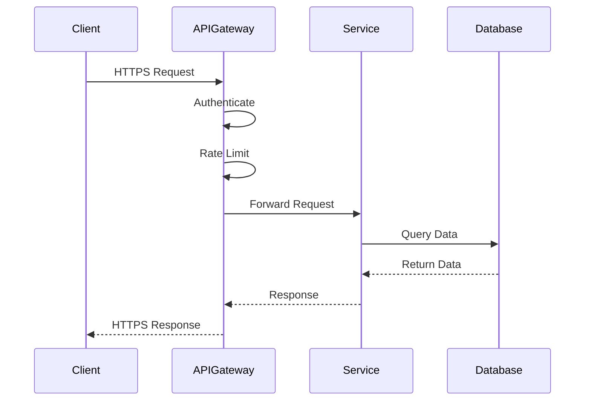
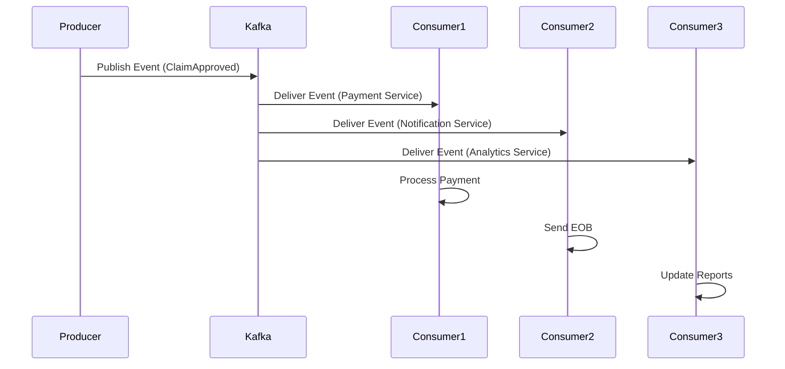
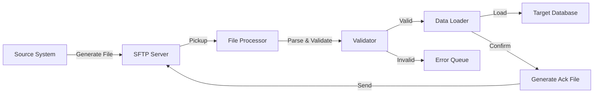
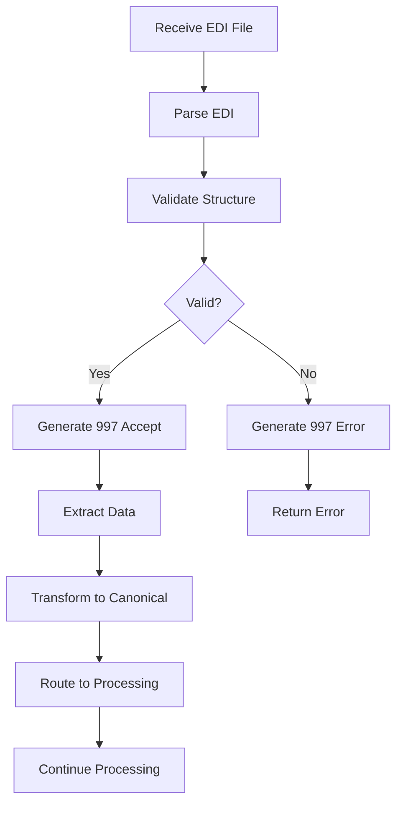
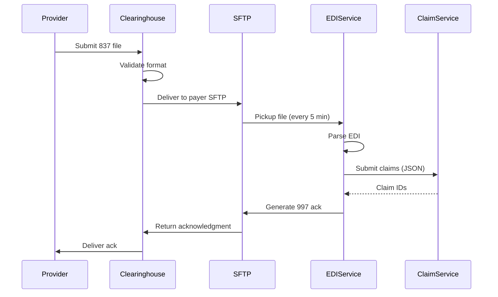
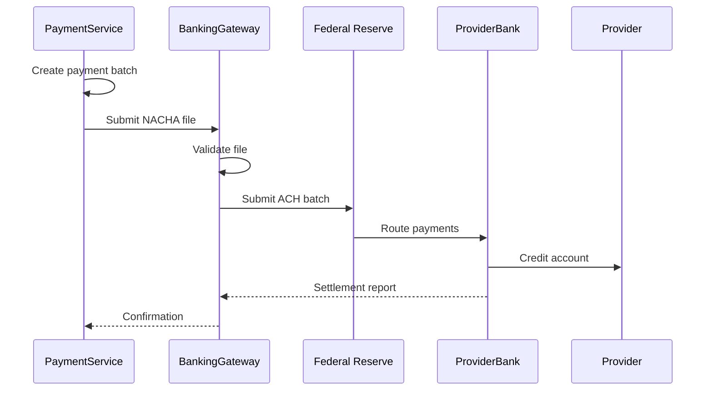

# Integration Architecture - Healthcare Claim Process

## Overview

This document describes the integration architecture for the healthcare claim processing system, including external system integrations, API patterns, data exchange protocols, and integration patterns.

## Integration Landscape

```mermaid
graph TB
    subgraph "Internal Systems"
        ClaimSystem[Claim Processing System]
        MemberSystem[Member Enrollment System]
        ProviderSystem[Provider Network System]
        BenefitSystem[Benefit Configuration System]
        PriorAuth[Prior Authorization System]
    end
    
    subgraph "External Healthcare"
        EDI[EDI Clearinghouses]
        Providers[Healthcare Providers]
        Labs[Laboratory Systems]
        Pharmacy[Pharmacy Benefit Manager]
        HIE[Health Information Exchange]
    end
    
    subgraph "External Business"
        Banking[Banking Systems]
        PaymentGateway[Payment Processors]
        ThirdPartyAdmin[Third Party Administrators]
    end
    
    subgraph "Regulatory & Compliance"
        CMS[CMS/Medicare Systems]
        StateAgencies[State Agencies]
        NCQA[NCQA Reporting]
    end
    
    subgraph "Technology Partners"
        CloudServices[AWS Services]
        Monitoring[Datadog/Monitoring]
        Auth[Okta Identity]
        DocManagement[Document Management]
    end
    
    ClaimSystem <-->|X12 837/835| EDI
    ClaimSystem <-->|HL7 FHIR| Providers
    ClaimSystem <-->|REST API| Labs
    ClaimSystem <-->|REST API| Pharmacy
    ClaimSystem <-->|HL7 v2/FHIR| HIE
    
    ClaimSystem <-->|NACHA/ACH| Banking
    ClaimSystem <-->|REST API| PaymentGateway
    ClaimSystem <-->|SFTP| ThirdPartyAdmin
    
    ClaimSystem -->|SFTP| CMS
    ClaimSystem -->|SFTP| StateAgencies
    ClaimSystem -->|REST API| NCQA
    
    ClaimSystem -->|SDK/API| CloudServices
    ClaimSystem -->|Agent/API| Monitoring
    ClaimSystem -->|OIDC/SAML| Auth
```



## Integration Patterns

### 1. Synchronous Integration (REST API)

**Use Cases**:
- Real-time eligibility verification
- Provider lookup
- Benefit inquiry
- Claim status check

**Pattern**:


**Example - Eligibility Verification**:
```http
POST /api/v1/eligibility/verify
Content-Type: application/json
Authorization: Bearer {token}

{
  "memberId": "M123456",
  "providerId": "P789012",
  "serviceDate": "2026-01-15",
  "serviceType": "30"
}

Response (200 OK):
{
  "eligible": true,
  "coverageLevel": "FAMILY",
  "plan": {
    "planId": "HMO-GOLD-2026",
    "planName": "Gold HMO Plan",
    "effectiveDate": "2026-01-01",
    "terminationDate": null
  },
  "deductible": {
    "individual": {
      "limit": 1500.00,
      "met": 800.00,
      "remaining": 700.00
    }
  },
  "copay": {
    "amount": 25.00,
    "serviceType": "PRIMARY_CARE"
  }
}
```

**API Standards**:
- RESTful principles
- OpenAPI 3.0 specification
- JSON request/response
- Standard HTTP status codes
- HATEOAS for navigation
- Pagination for collections

### 2. Asynchronous Integration (Event-Driven)

**Use Cases**:
- Claim status notifications
- Payment processing
- Audit logging
- Analytics data pipeline

**Pattern**:


**Event Schema**:
```json
{
  "eventId": "evt-123456",
  "eventType": "ClaimApproved",
  "eventTime": "2026-01-15T10:32:00Z",
  "source": "adjudication-service",
  "specVersion": "1.0",
  "data": {
    "claimId": "CLM-2026-00123456",
    "memberId": "M123456",
    "providerId": "P789012",
    "totalPaid": 1200.00,
    "memberResponsibility": 240.00,
    "adjudicationDate": "2026-01-15T10:32:00Z"
  }
}
```

**Kafka Topics**:
- `claims.received` - New claim submissions
- `claims.validated` - Claims passing validation
- `claims.adjudicated` - Adjudication completed
- `claims.paid` - Payments processed
- `claims.denied` - Claim denials
- `payments.submitted` - Payment batch submitted
- `notifications.outbound` - Notifications to send

### 3. Batch Integration (File-Based)

**Use Cases**:
- Large volume data exchange
- Regulatory reporting
- Data warehouse updates
- Legacy system integration

**Pattern**:


**File Formats**:
- **EDI (X12)**: Claims, remittance, eligibility
- **CSV**: Reporting extracts
- **JSON**: API-style batch data
- **HL7**: Clinical data exchange
- **Parquet**: Analytics data

**Example - Daily Payment File**:
```csv
PaymentNumber,PaymentDate,PayeeType,PayeeID,PaymentAmount,ClaimCount,PaymentMethod
PAY-2026-00001,2026-01-15,PROVIDER,P789012,15420.50,47,EFT
PAY-2026-00002,2026-01-15,PROVIDER,P789013,8750.00,23,EFT
PAY-2026-00003,2026-01-15,MEMBER,M123456,350.00,1,CHECK
```

### 4. EDI Integration

**Supported Transactions**:

| Transaction | Type | Direction | Description |
|------------|------|-----------|-------------|
| 837P | Claim | Inbound | Professional claims |
| 837I | Claim | Inbound | Institutional claims |
| 837D | Claim | Inbound | Dental claims |
| 835 | Remittance | Outbound | Payment advice |
| 270 | Eligibility | Inbound | Eligibility inquiry |
| 271 | Eligibility | Outbound | Eligibility response |
| 276 | Claim Status | Inbound | Status inquiry |
| 277 | Claim Status | Outbound | Status response |
| 278 | Authorization | Bidirectional | Prior authorization |
| 997 | Acknowledgment | Outbound | Functional acknowledgment |
| 999 | Acknowledgment | Outbound | Implementation acknowledgment |

**EDI Processing Flow**:


**Example - 837 to JSON Transformation**:
```
EDI 837P Input:
ISA*00*          *00*          *ZZ*SUBMITTERID    *ZZ*PAYERID        *260115*1030*^*00501*000000001*0*P*:~
GS*HC*SUBMITTERID*PAYERID*20260115*1030*1*X*005010X222A1~
ST*837*0001*005010X222A1~
BHT*0019*00*123456*20260115*1030*CH~
...

JSON Output:
{
  "transactionType": "837P",
  "submitterId": "SUBMITTERID",
  "payerId": "PAYERID",
  "submissionDate": "2026-01-15T10:30:00Z",
  "claims": [
    {
      "patientFirstName": "John",
      "patientLastName": "Doe",
      "memberId": "M123456",
      ...
    }
  ]
}
```

### 5. FHIR Integration

**Purpose**: Standards-based API for healthcare interoperability

**Supported Resources**:
- **Patient**: Member demographics
- **Coverage**: Insurance coverage
- **Claim**: Claim submission
- **ClaimResponse**: Adjudication result
- **ExplanationOfBenefit**: EOB data
- **Organization**: Provider organizations
- **Practitioner**: Individual providers

**Example - FHIR Claim Submission**:
```http
POST /fhir/Claim
Content-Type: application/fhir+json

{
  "resourceType": "Claim",
  "status": "active",
  "type": {
    "coding": [{
      "system": "http://terminology.hl7.org/CodeSystem/claim-type",
      "code": "professional"
    }]
  },
  "patient": {
    "reference": "Patient/M123456"
  },
  "provider": {
    "reference": "Practitioner/P789012"
  },
  "insurance": [{
    "sequence": 1,
    "focal": true,
    "coverage": {
      "reference": "Coverage/COV-123"
    }
  }],
  "item": [{
    "sequence": 1,
    "productOrService": {
      "coding": [{
        "system": "http://www.ama-assn.org/go/cpt",
        "code": "99213"
      }]
    },
    "servicedDate": "2026-01-15",
    "unitPrice": {
      "value": 150.00,
      "currency": "USD"
    }
  }]
}
```

**FHIR Bulk Data Export**:
```http
GET /fhir/$export?_type=ExplanationOfBenefit&_since=2026-01-01

Response (202 Accepted):
Content-Location: https://api.example.com/fhir/$export-status/12345

Poll status endpoint:
GET /fhir/$export-status/12345

Response (200 OK) when complete:
{
  "transactionTime": "2026-01-15T10:00:00Z",
  "request": "/fhir/$export?_type=ExplanationOfBenefit",
  "requiresAccessToken": true,
  "output": [{
    "type": "ExplanationOfBenefit",
    "url": "https://storage.example.com/eob-export.ndjson"
  }]
}
```

## External System Integrations

### 1. EDI Clearinghouse Integration

**Purpose**: Trading partner connectivity for standardized EDI transactions

**Clearinghouse Partners**:
- Change Healthcare
- Availity
- Trizetto
- Waystar

**Communication Protocol**:
- SFTP/FTPS for file transfer
- AS2 for real-time transmission
- HTTPS for API-based submission

**File Exchange**:
```
Inbound (from providers):
- 837 claim files (every 15 minutes)
- 270 eligibility requests (real-time)
- 276 status inquiries

Outbound (to providers):
- 835 remittance advice (daily)
- 271 eligibility responses (real-time)
- 277 status responses
- 997/999 acknowledgments
```

**Integration Pattern**:


### 2. Banking System Integration

**Purpose**: Electronic payment processing (ACH/EFT)

**Payment Flow**:


**NACHA File Format**:
```
File Header Record (Type 1):
101 091000019 1234567890 260115 1030A094101BANK NAME            COMPANY NAME           

Batch Header Record (Type 5):
5200COMPANY NAME                        1234567890PPDPAYROLL   260115260115   1091000010000001

Entry Detail Record (Type 6):
622091000019123456789        0000015420PAY-2026-00001  PROVIDER NAME          0091000010000001

Batch Control Record (Type 8):
82000000010009100001900000000000000000154200001234567890                         091000010000001

File Control Record (Type 9):
9000001000001000000010009100001900000000000000000154200                                       
```

### 3. Pharmacy Benefit Manager (PBM) Integration

**Purpose**: Coordination for pharmacy claims and benefits

**Integration Method**: REST API

**Key APIs**:

```http
# Check drug coverage
POST /api/v1/formulary/check
{
  "memberId": "M123456",
  "ndc": "12345-678-90",
  "quantity": 30,
  "daysSupply": 30
}

Response:
{
  "covered": true,
  "tier": "GENERIC",
  "priorAuthRequired": false,
  "quantityLimit": 60,
  "stepTherapyRequired": false,
  "estimatedMemberCost": 10.00
}

# Submit pharmacy claim
POST /api/v1/claims/pharmacy
{
  "memberId": "M123456",
  "pharmacyNpi": "1234567890",
  "ndc": "12345-678-90",
  "quantity": 30,
  "daysSupply": 30,
  "prescriberId": "9876543210",
  "fillDate": "2026-01-15",
  "submittedAmount": 125.00
}
```

### 4. Prior Authorization System Integration

**Purpose**: Verify prior authorization for services

**Integration Method**: REST API + Events

**Authorization Check**:
```http
GET /api/v1/authorization/check?memberId=M123456&procedureCode=99213&serviceDate=2026-01-15

Response:
{
  "authorizationRequired": false
}

OR

{
  "authorizationRequired": true,
  "authorizationNumber": "AUTH-2026-12345",
  "authorizationStatus": "APPROVED",
  "approvedUnits": 10,
  "effectiveDate": "2026-01-01",
  "expirationDate": "2026-06-30",
  "approvedServices": ["99213", "99214"]
}
```

**Event-Driven Updates**:
```json
Topic: authorizations.updated
{
  "eventType": "AuthorizationApproved",
  "authorizationNumber": "AUTH-2026-12345",
  "memberId": "M123456",
  "procedureCode": "99213",
  "approvedUnits": 10,
  "effectiveDate": "2026-01-01"
}
```

### 5. Health Information Exchange (HIE) Integration

**Purpose**: Exchange clinical data for care coordination

**Standards**: HL7 FHIR, HL7 v2, CDA

**Use Cases**:
- Query member medical history
- Receive admission/discharge notifications
- Share care gaps
- Retrieve lab results

**FHIR Query Example**:
```http
GET /fhir/Condition?patient=M123456&clinical-status=active

Response:
{
  "resourceType": "Bundle",
  "type": "searchset",
  "entry": [{
    "resource": {
      "resourceType": "Condition",
      "code": {
        "coding": [{
          "system": "http://snomed.info/sct",
          "code": "73211009",
          "display": "Diabetes mellitus"
        }]
      },
      "subject": {
        "reference": "Patient/M123456"
      }
    }
  }]
}
```

### 6. CMS/Medicare Integration

**Purpose**: Medicare Advantage plan data submission

**Data Submissions**:
- Encounter data (monthly)
- Risk adjustment data (quarterly)
- Stars measures (annual)
- Compliance reporting

**Protocol**: SFTP

**Example - Encounter Data File**:
```csv
MemberID,ClaimID,ServiceDate,DiagnosisCode,ProcedureCode,ProviderNPI
M123456,CLM-2026-00123456,2026-01-15,E11.9,99213,1234567890
```

## API Management

### API Gateway (Kong)

**Capabilities**:
- Authentication/Authorization
- Rate limiting
- Request/response transformation
- Caching
- Analytics
- Circuit breaking

**Rate Limiting Example**:
```yaml
plugins:
  - name: rate-limiting
    config:
      minute: 100
      hour: 1000
      policy: local
      limit_by: consumer
      fault_tolerant: true
```

### API Security

**Authentication**:
- OAuth 2.0 for external partners
- JWT for internal services
- API keys for legacy systems
- Mutual TLS for high-security integrations

**Authorization**:
```http
POST /oauth/token
Content-Type: application/x-www-form-urlencoded

grant_type=client_credentials
&client_id={client_id}
&client_secret={client_secret}
&scope=claims:read claims:write

Response:
{
  "access_token": "eyJhbGc...",
  "token_type": "Bearer",
  "expires_in": 3600,
  "scope": "claims:read claims:write"
}

Use token:
GET /api/v1/claims/CLM-2026-00123456
Authorization: Bearer eyJhbGc...
```

### API Versioning

**Strategy**: URL path versioning

```
/api/v1/claims       - Version 1 (current)
/api/v2/claims       - Version 2 (new features)
/api/v1/claims       - Deprecated after v3 released
```

**Deprecation Policy**:
- Minimum 12 months notice
- Version support for 24 months after deprecation
- Clear migration guide

### API Documentation

**OpenAPI 3.0 Specification**:
```yaml
openapi: 3.0.0
info:
  title: Healthcare Claim API
  version: 1.0.0
  description: API for healthcare claim processing
  
paths:
  /api/v1/claims:
    post:
      summary: Submit a new claim
      security:
        - OAuth2: [claims:write]
      requestBody:
        content:
          application/json:
            schema:
              $ref: '#/components/schemas/Claim'
      responses:
        '201':
          description: Claim created
          content:
            application/json:
              schema:
                $ref: '#/components/schemas/ClaimResponse'
                
components:
  schemas:
    Claim:
      type: object
      required:
        - memberId
        - providerId
        - serviceDate
      properties:
        memberId:
          type: string
        providerId:
          type: string
        serviceDate:
          type: string
          format: date
```

## Integration Monitoring

### Health Checks

```http
GET /health
Response:
{
  "status": "UP",
  "components": {
    "database": {"status": "UP"},
    "kafka": {"status": "UP"},
    "redis": {"status": "UP"},
    "edi-clearinghouse": {"status": "UP"},
    "banking-api": {"status": "UP"}
  }
}
```

### Metrics

**Integration Metrics**:
- API request count
- API response time (p50, p95, p99)
- Error rate
- Throughput (requests/sec)
- Circuit breaker status

**EDI Metrics**:
- Files processed per hour
- Transaction volume
- Error/rejection rate
- Processing latency

**Event Metrics**:
- Events published
- Events consumed
- Consumer lag
- Processing time

### Alerting

**Alert Conditions**:
- API error rate > 5%
- API response time p95 > 2 seconds
- Circuit breaker open
- Consumer lag > 1000 messages
- File processing failure
- ACH file rejection

## Error Handling

### Retry Strategy

**Exponential Backoff**:
```python
def retry_with_backoff(func, max_retries=3):
    for attempt in range(max_retries):
        try:
            return func()
        except RetryableError as e:
            if attempt == max_retries - 1:
                raise
            wait_time = (2 ** attempt) + random.uniform(0, 1)
            time.sleep(wait_time)
```

### Circuit Breaker

**States**:
- **Closed**: Normal operation
- **Open**: Too many failures, reject requests
- **Half-Open**: Testing if service recovered

**Configuration**:
```yaml
circuit-breaker:
  failure-threshold: 5
  timeout: 60000  # 60 seconds
  half-open-max-calls: 3
```

### Dead Letter Queue

**Purpose**: Handle messages that cannot be processed

**Process**:
1. Message fails processing
2. Retry configured number of times
3. If still failing, move to DLQ
4. Alert operations team
5. Manual investigation and replay

---
*Document Version: 1.0*
*Last Updated: January 2026*
*Owner: Integration Architecture Team*
