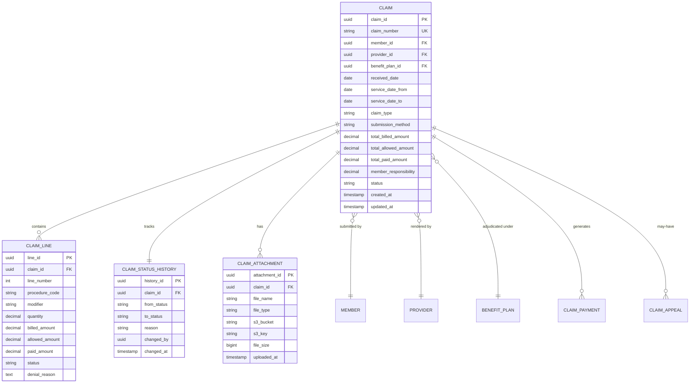
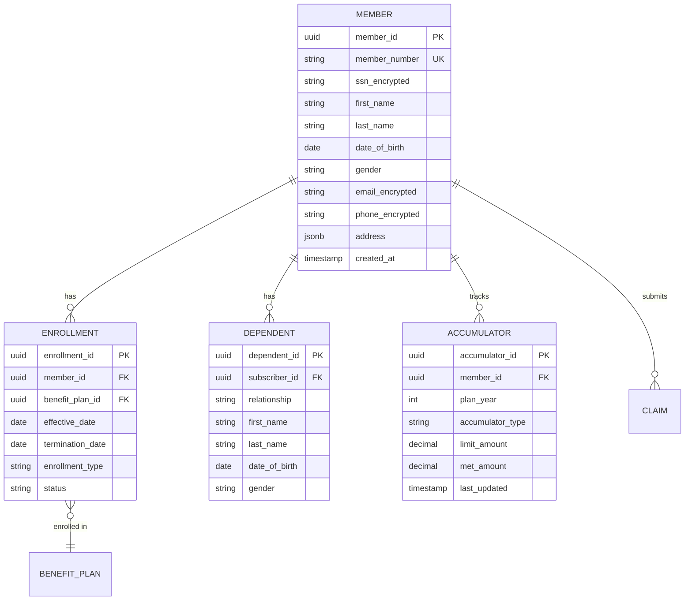
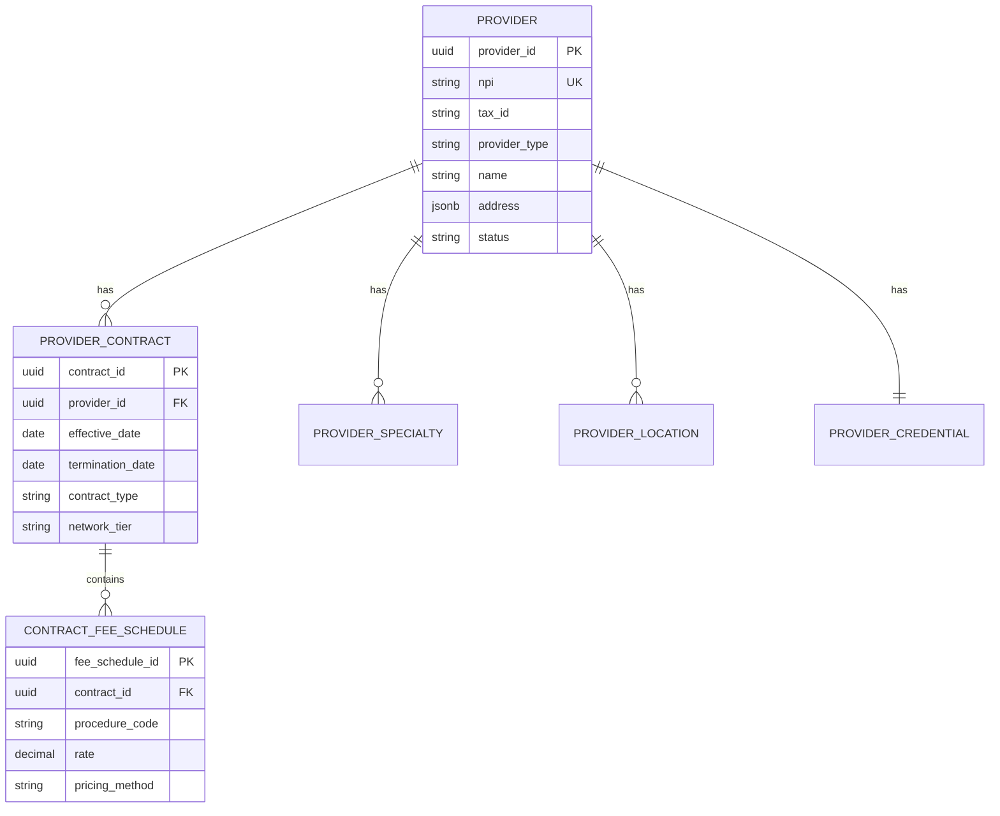
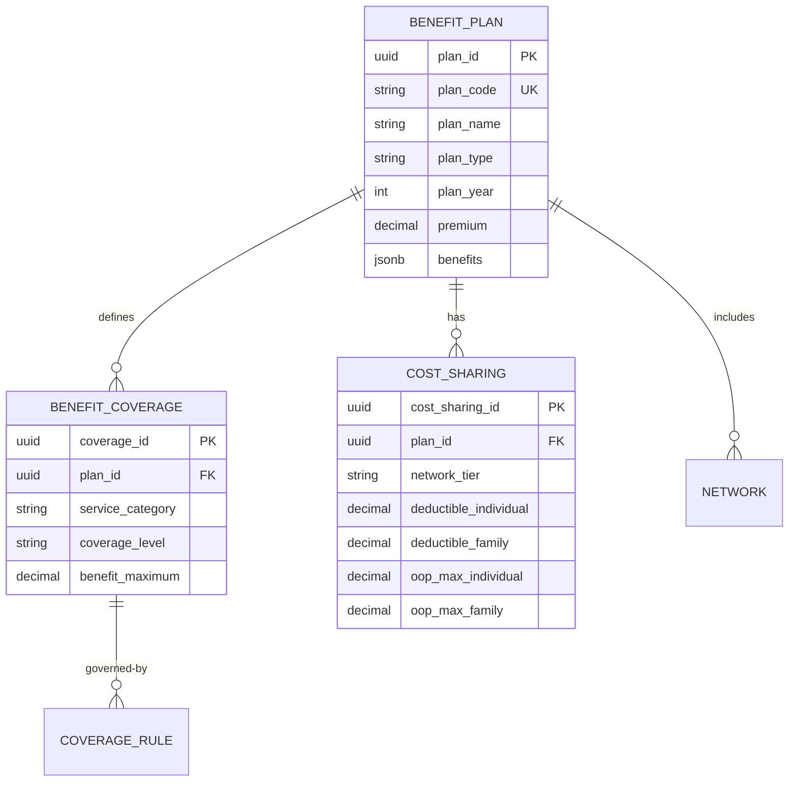

# Data Architecture - Healthcare Claim Process

## Overview

This document describes the data architecture, data models, and database schemas for the healthcare claim processing system. The data architecture is designed to support high transaction volumes, complex querying, and regulatory compliance requirements.

## Data Architecture Principles

### 1. Data Integrity
- ACID compliance for transactional data
- Referential integrity enforcement
- Data validation at multiple layers
- Audit trails for all changes

### 2. Data Security
- Encryption at rest and in transit
- Field-level encryption for sensitive data
- Role-based access control
- Data masking for non-production environments

### 3. Data Privacy
- HIPAA compliance for PHI
- Data retention policies
- Right to be forgotten capability
- Minimum necessary access

### 4. Performance
- Optimized indexes for common queries
- Partitioning for large tables
- Caching strategy
- Read replicas for reporting

### 5. Scalability
- Horizontal partitioning (sharding) capability
- Archive strategy for historical data
- Compression for storage optimization

## Database Strategy

### Transactional Databases (PostgreSQL)

**Use Cases**:
- Real-time claim processing
- Member and provider data
- Benefit configuration
- Operational data

**Characteristics**:
- ACID compliance
- Strong consistency
- Complex transactions
- Relational integrity

**Database Instances**:

| Database | Purpose | Size | Backup Strategy |
|----------|---------|------|-----------------|
| ClaimDB | Claim processing | 5TB | Continuous WAL archival |
| MemberDB | Member enrollment | 2TB | Daily snapshots |
| ProviderDB | Provider network | 1TB | Daily snapshots |
| BenefitDB | Benefit plans | 500GB | Daily snapshots |
| AuthDB | User authentication | 100GB | Daily snapshots |

### Analytical Database (Snowflake)

**Use Cases**:
- Business intelligence
- Regulatory reporting
- Trend analysis
- Data science / ML

**Characteristics**:
- Column-oriented storage
- Massive parallel processing
- Separate compute and storage
- Support for semi-structured data

**Data Refresh**:
- Incremental updates every 15 minutes
- Full refresh daily
- Near real-time dashboards

### Cache Layer (Redis)

**Use Cases**:
- Session management
- Eligibility caching
- Fee schedule caching
- Rate limiting

**Data Types Cached**:
- Member eligibility (TTL: 1 hour)
- Provider network status (TTL: 4 hours)
- Benefit plan rules (TTL: 24 hours)
- Fee schedules (TTL: 24 hours)
- Session tokens (TTL: 30 minutes)

### Document Storage (AWS S3)

**Use Cases**:
- Claim attachments
- EOB documents
- Correspondence
- Medical records
- Appeals documentation

**Organization**:
```
s3://claims-attachments/
  └── {year}/
      └── {month}/
          └── {claim-id}/
              ├── attachment-1.pdf
              ├── attachment-2.jpg
              └── metadata.json
```

**Retention**:
- Active claims: 2 years in standard storage
- Closed claims: 8 years in glacier storage
- Total retention: 10 years

## Core Data Models

### 1. Claim Data Model

**Entity-Relationship Diagram**:



**Claim Table Schema**:

```sql
CREATE TABLE claims (
    claim_id UUID PRIMARY KEY DEFAULT gen_random_uuid(),
    claim_number VARCHAR(50) UNIQUE NOT NULL,
    member_id UUID NOT NULL REFERENCES members(member_id),
    provider_id UUID NOT NULL REFERENCES providers(provider_id),
    benefit_plan_id UUID NOT NULL REFERENCES benefit_plans(plan_id),
    
    -- Dates
    received_date TIMESTAMP NOT NULL DEFAULT CURRENT_TIMESTAMP,
    service_date_from DATE NOT NULL,
    service_date_to DATE NOT NULL,
    processed_date TIMESTAMP,
    paid_date TIMESTAMP,
    
    -- Classification
    claim_type VARCHAR(20) NOT NULL CHECK (claim_type IN ('PROFESSIONAL', 'INSTITUTIONAL', 'DENTAL', 'PHARMACY')),
    submission_method VARCHAR(20) CHECK (submission_method IN ('EDI', 'PORTAL', 'MOBILE', 'PAPER', 'FAX')),
    
    -- Financial
    total_billed_amount DECIMAL(12,2) NOT NULL,
    total_allowed_amount DECIMAL(12,2),
    total_paid_amount DECIMAL(12,2),
    member_responsibility DECIMAL(12,2),
    
    -- Status
    status VARCHAR(30) NOT NULL CHECK (status IN ('RECEIVED', 'VALIDATING', 'PENDED', 'ADJUDICATING', 'APPROVED', 'DENIED', 'PAID', 'APPEALED')),
    substatus VARCHAR(50),
    
    -- Processing
    auto_adjudicated BOOLEAN DEFAULT FALSE,
    fraud_score DECIMAL(5,4),
    requires_review BOOLEAN DEFAULT FALSE,
    
    -- Coordination of Benefits
    has_cob BOOLEAN DEFAULT FALSE,
    is_primary BOOLEAN DEFAULT TRUE,
    
    -- Raw Data
    raw_data JSONB,
    
    -- Audit
    created_at TIMESTAMP NOT NULL DEFAULT CURRENT_TIMESTAMP,
    created_by UUID,
    updated_at TIMESTAMP NOT NULL DEFAULT CURRENT_TIMESTAMP,
    updated_by UUID,
    
    -- Indexes
    CONSTRAINT fk_member FOREIGN KEY (member_id) REFERENCES members(member_id),
    CONSTRAINT fk_provider FOREIGN KEY (provider_id) REFERENCES providers(provider_id),
    CONSTRAINT fk_benefit_plan FOREIGN KEY (benefit_plan_id) REFERENCES benefit_plans(plan_id)
);

-- Indexes for common queries
CREATE INDEX idx_claims_member_id ON claims(member_id);
CREATE INDEX idx_claims_provider_id ON claims(provider_id);
CREATE INDEX idx_claims_status ON claims(status);
CREATE INDEX idx_claims_received_date ON claims(received_date);
CREATE INDEX idx_claims_service_date ON claims(service_date_from, service_date_to);
CREATE INDEX idx_claims_claim_number ON claims(claim_number);

-- Partitioning by received_date (monthly partitions)
CREATE TABLE claims_2026_01 PARTITION OF claims
    FOR VALUES FROM ('2026-01-01') TO ('2026-02-01');
CREATE TABLE claims_2026_02 PARTITION OF claims
    FOR VALUES FROM ('2026-02-01') TO ('2026-03-01');
-- ... additional partitions
```

**Claim Line Table Schema**:

```sql
CREATE TABLE claim_lines (
    line_id UUID PRIMARY KEY DEFAULT gen_random_uuid(),
    claim_id UUID NOT NULL REFERENCES claims(claim_id) ON DELETE CASCADE,
    line_number INTEGER NOT NULL,
    
    -- Service Details
    procedure_code VARCHAR(10) NOT NULL,
    modifier_1 VARCHAR(2),
    modifier_2 VARCHAR(2),
    modifier_3 VARCHAR(2),
    modifier_4 VARCHAR(2),
    quantity DECIMAL(10,2) NOT NULL DEFAULT 1,
    
    -- Diagnosis
    diagnosis_code_1 VARCHAR(10),
    diagnosis_code_2 VARCHAR(10),
    diagnosis_code_3 VARCHAR(10),
    diagnosis_code_4 VARCHAR(10),
    
    -- Financial
    billed_amount DECIMAL(10,2) NOT NULL,
    allowed_amount DECIMAL(10,2),
    paid_amount DECIMAL(10,2),
    deductible_amount DECIMAL(10,2),
    coinsurance_amount DECIMAL(10,2),
    copay_amount DECIMAL(10,2),
    
    -- Status
    status VARCHAR(30) NOT NULL,
    denial_reason_code VARCHAR(10),
    denial_reason_text TEXT,
    remark_codes VARCHAR(100),
    
    -- Pricing
    fee_schedule_amount DECIMAL(10,2),
    contract_amount DECIMAL(10,2),
    
    -- Audit
    created_at TIMESTAMP NOT NULL DEFAULT CURRENT_TIMESTAMP,
    updated_at TIMESTAMP NOT NULL DEFAULT CURRENT_TIMESTAMP,
    
    CONSTRAINT uk_claim_line UNIQUE (claim_id, line_number)
);

CREATE INDEX idx_claim_lines_claim_id ON claim_lines(claim_id);
CREATE INDEX idx_claim_lines_procedure_code ON claim_lines(procedure_code);
```

### 2. Member Data Model



**Member Table Schema**:

```sql
CREATE TABLE members (
    member_id UUID PRIMARY KEY DEFAULT gen_random_uuid(),
    member_number VARCHAR(20) UNIQUE NOT NULL,
    
    -- Personal Information (Encrypted)
    ssn_encrypted BYTEA,
    first_name VARCHAR(100) NOT NULL,
    last_name VARCHAR(100) NOT NULL,
    middle_name VARCHAR(100),
    date_of_birth DATE NOT NULL,
    gender CHAR(1) CHECK (gender IN ('M', 'F', 'U', 'O')),
    
    -- Contact Information (Encrypted)
    email_encrypted BYTEA,
    phone_encrypted BYTEA,
    address JSONB,
    
    -- Demographics
    language_preference VARCHAR(10) DEFAULT 'en',
    ethnicity VARCHAR(50),
    race VARCHAR(50),
    
    -- Communication Preferences
    email_opt_in BOOLEAN DEFAULT TRUE,
    sms_opt_in BOOLEAN DEFAULT FALSE,
    paper_eob BOOLEAN DEFAULT TRUE,
    
    -- Account
    portal_access BOOLEAN DEFAULT FALSE,
    last_login TIMESTAMP,
    
    -- Audit
    created_at TIMESTAMP NOT NULL DEFAULT CURRENT_TIMESTAMP,
    created_by UUID,
    updated_at TIMESTAMP NOT NULL DEFAULT CURRENT_TIMESTAMP,
    updated_by UUID,
    
    -- Privacy
    data_sharing_consent BOOLEAN DEFAULT FALSE,
    marketing_consent BOOLEAN DEFAULT FALSE
);

CREATE INDEX idx_members_dob ON members(date_of_birth);
CREATE INDEX idx_members_last_name ON members(last_name);
CREATE INDEX idx_members_member_number ON members(member_number);
```

**Enrollment Table Schema**:

```sql
CREATE TABLE enrollments (
    enrollment_id UUID PRIMARY KEY DEFAULT gen_random_uuid(),
    member_id UUID NOT NULL REFERENCES members(member_id),
    benefit_plan_id UUID NOT NULL REFERENCES benefit_plans(plan_id),
    
    -- Coverage Period
    effective_date DATE NOT NULL,
    termination_date DATE,
    
    -- Classification
    enrollment_type VARCHAR(20) CHECK (enrollment_type IN ('SUBSCRIBER', 'DEPENDENT', 'COBRA', 'CONTINUATION')),
    coverage_level VARCHAR(20) CHECK (coverage_level IN ('INDIVIDUAL', 'FAMILY', 'EMPLOYEE_SPOUSE', 'EMPLOYEE_CHILDREN')),
    
    -- Subscriber Relationship
    subscriber_id UUID REFERENCES members(member_id),
    relationship VARCHAR(20),
    
    -- Status
    status VARCHAR(20) CHECK (status IN ('ACTIVE', 'TERMINATED', 'SUSPENDED', 'PENDING')),
    termination_reason VARCHAR(50),
    
    -- Group Information
    group_id UUID,
    group_number VARCHAR(50),
    
    -- Audit
    created_at TIMESTAMP NOT NULL DEFAULT CURRENT_TIMESTAMP,
    updated_at TIMESTAMP NOT NULL DEFAULT CURRENT_TIMESTAMP,
    
    CONSTRAINT fk_member FOREIGN KEY (member_id) REFERENCES members(member_id),
    CONSTRAINT fk_subscriber FOREIGN KEY (subscriber_id) REFERENCES members(member_id),
    CONSTRAINT fk_benefit_plan FOREIGN KEY (benefit_plan_id) REFERENCES benefit_plans(plan_id)
);

CREATE INDEX idx_enrollments_member_id ON enrollments(member_id);
CREATE INDEX idx_enrollments_effective_date ON enrollments(effective_date);
CREATE INDEX idx_enrollments_status ON enrollments(status);
```

**Accumulator Table Schema**:

```sql
CREATE TABLE accumulators (
    accumulator_id UUID PRIMARY KEY DEFAULT gen_random_uuid(),
    member_id UUID NOT NULL REFERENCES members(member_id),
    enrollment_id UUID NOT NULL REFERENCES enrollments(enrollment_id),
    
    -- Plan Year
    plan_year INTEGER NOT NULL,
    
    -- Accumulator Type
    accumulator_type VARCHAR(30) NOT NULL CHECK (accumulator_type IN 
        ('DEDUCTIBLE_INDIVIDUAL', 'DEDUCTIBLE_FAMILY', 
         'OOP_INDIVIDUAL', 'OOP_FAMILY',
         'BENEFIT_MAXIMUM', 'VISIT_COUNT')),
    
    -- Amounts
    limit_amount DECIMAL(10,2) NOT NULL,
    met_amount DECIMAL(10,2) NOT NULL DEFAULT 0,
    remaining_amount DECIMAL(10,2) GENERATED ALWAYS AS (limit_amount - met_amount) STORED,
    
    -- Network
    network_tier VARCHAR(20) CHECK (network_tier IN ('IN_NETWORK', 'OUT_OF_NETWORK', 'COMBINED')),
    
    -- Last Update
    last_updated TIMESTAMP NOT NULL DEFAULT CURRENT_TIMESTAMP,
    last_claim_id UUID REFERENCES claims(claim_id),
    
    -- Audit
    created_at TIMESTAMP NOT NULL DEFAULT CURRENT_TIMESTAMP,
    
    CONSTRAINT uk_accumulator UNIQUE (member_id, plan_year, accumulator_type, network_tier)
);

CREATE INDEX idx_accumulators_member_year ON accumulators(member_id, plan_year);
CREATE INDEX idx_accumulators_type ON accumulators(accumulator_type);
```

### 3. Provider Data Model



**Provider Table Schema**:

```sql
CREATE TABLE providers (
    provider_id UUID PRIMARY KEY DEFAULT gen_random_uuid(),
    
    -- Identifiers
    npi VARCHAR(10) UNIQUE NOT NULL,
    tax_id_encrypted BYTEA,
    state_license_number VARCHAR(50),
    dea_number VARCHAR(20),
    
    -- Provider Type
    provider_type VARCHAR(20) CHECK (provider_type IN ('INDIVIDUAL', 'ORGANIZATION', 'FACILITY')),
    taxonomy_code VARCHAR(10),
    
    -- Name
    organization_name VARCHAR(200),
    first_name VARCHAR(100),
    last_name VARCHAR(100),
    credentials VARCHAR(50),
    
    -- Contact
    address JSONB,
    phone VARCHAR(20),
    fax VARCHAR(20),
    email VARCHAR(100),
    
    -- Network Status
    network_status VARCHAR(20) CHECK (network_status IN ('IN_NETWORK', 'OUT_OF_NETWORK', 'PENDING', 'TERMINATED')),
    network_tier VARCHAR(20),
    
    -- Credentialing
    credentialed BOOLEAN DEFAULT FALSE,
    credential_date DATE,
    recredential_date DATE,
    
    -- Payment
    payment_method VARCHAR(20) CHECK (payment_method IN ('EFT', 'CHECK', 'VIRTUAL_CARD')),
    bank_account_encrypted BYTEA,
    routing_number_encrypted BYTEA,
    
    -- Status
    status VARCHAR(20) CHECK (status IN ('ACTIVE', 'INACTIVE', 'SUSPENDED', 'TERMINATED')),
    
    -- Audit
    created_at TIMESTAMP NOT NULL DEFAULT CURRENT_TIMESTAMP,
    updated_at TIMESTAMP NOT NULL DEFAULT CURRENT_TIMESTAMP,
    
    CONSTRAINT chk_provider_name CHECK (
        (provider_type = 'ORGANIZATION' AND organization_name IS NOT NULL) OR
        (provider_type IN ('INDIVIDUAL', 'FACILITY') AND first_name IS NOT NULL AND last_name IS NOT NULL)
    )
);

CREATE INDEX idx_providers_npi ON providers(npi);
CREATE INDEX idx_providers_network_status ON providers(network_status);
CREATE INDEX idx_providers_last_name ON providers(last_name);
```

### 4. Benefit Plan Data Model



**Benefit Plan Table Schema**:

```sql
CREATE TABLE benefit_plans (
    plan_id UUID PRIMARY KEY DEFAULT gen_random_uuid(),
    plan_code VARCHAR(50) UNIQUE NOT NULL,
    plan_name VARCHAR(200) NOT NULL,
    
    -- Plan Classification
    plan_type VARCHAR(20) CHECK (plan_type IN ('HMO', 'PPO', 'EPO', 'POS', 'HDHP')),
    market_segment VARCHAR(20) CHECK (market_segment IN ('COMMERCIAL', 'MEDICARE', 'MEDICAID', 'EXCHANGE')),
    metal_level VARCHAR(20) CHECK (metal_level IN ('BRONZE', 'SILVER', 'GOLD', 'PLATINUM', 'CATASTROPHIC')),
    
    -- Plan Year
    plan_year INTEGER NOT NULL,
    effective_date DATE NOT NULL,
    termination_date DATE,
    
    -- Financial
    premium_amount DECIMAL(10,2),
    
    -- Network
    network_id UUID,
    network_type VARCHAR(20),
    
    -- Benefits (stored as JSONB for flexibility)
    benefits JSONB,
    
    -- Status
    status VARCHAR(20) CHECK (status IN ('ACTIVE', 'INACTIVE', 'PENDING')),
    
    -- Audit
    created_at TIMESTAMP NOT NULL DEFAULT CURRENT_TIMESTAMP,
    updated_at TIMESTAMP NOT NULL DEFAULT CURRENT_TIMESTAMP
);

CREATE INDEX idx_benefit_plans_plan_year ON benefit_plans(plan_year);
CREATE INDEX idx_benefit_plans_plan_type ON benefit_plans(plan_type);
```

**Cost Sharing Table Schema**:

```sql
CREATE TABLE cost_sharing (
    cost_sharing_id UUID PRIMARY KEY DEFAULT gen_random_uuid(),
    plan_id UUID NOT NULL REFERENCES benefit_plans(plan_id),
    
    -- Network Tier
    network_tier VARCHAR(20) CHECK (network_tier IN ('IN_NETWORK', 'OUT_OF_NETWORK', 'TIER_1', 'TIER_2')),
    
    -- Deductible
    deductible_individual DECIMAL(10,2) NOT NULL,
    deductible_family DECIMAL(10,2) NOT NULL,
    deductible_aggregate BOOLEAN DEFAULT TRUE,
    
    -- Out-of-Pocket Maximum
    oop_max_individual DECIMAL(10,2) NOT NULL,
    oop_max_family DECIMAL(10,2) NOT NULL,
    oop_aggregate BOOLEAN DEFAULT TRUE,
    
    -- Coinsurance
    default_coinsurance DECIMAL(5,4),
    
    -- Copays (stored as JSONB for different service types)
    copays JSONB,
    
    -- Effective Dates
    effective_date DATE NOT NULL,
    termination_date DATE,
    
    CONSTRAINT uk_cost_sharing UNIQUE (plan_id, network_tier, effective_date)
);
```

### 5. Payment Data Model

```sql
CREATE TABLE payments (
    payment_id UUID PRIMARY KEY DEFAULT gen_random_uuid(),
    payment_number VARCHAR(50) UNIQUE NOT NULL,
    
    -- Payee
    payee_type VARCHAR(20) CHECK (payee_type IN ('PROVIDER', 'MEMBER')),
    payee_id UUID NOT NULL,
    
    -- Payment Details
    payment_date DATE NOT NULL,
    payment_method VARCHAR(20) CHECK (payment_method IN ('EFT', 'CHECK', 'VIRTUAL_CARD')),
    payment_amount DECIMAL(12,2) NOT NULL,
    
    -- Banking
    bank_account_last4 VARCHAR(4),
    routing_number_last4 VARCHAR(4),
    check_number VARCHAR(20),
    trace_number VARCHAR(50),
    
    -- Claims
    claim_count INTEGER NOT NULL,
    total_billed DECIMAL(12,2),
    total_allowed DECIMAL(12,2),
    
    -- Remittance
    remittance_835_id UUID,
    remittance_sent_date TIMESTAMP,
    
    -- Status
    status VARCHAR(20) CHECK (status IN ('PENDING', 'SUBMITTED', 'CLEARED', 'REJECTED', 'CANCELLED')),
    
    -- Audit
    created_at TIMESTAMP NOT NULL DEFAULT CURRENT_TIMESTAMP,
    created_by UUID,
    processed_at TIMESTAMP
);

CREATE TABLE payment_claims (
    payment_claim_id UUID PRIMARY KEY DEFAULT gen_random_uuid(),
    payment_id UUID NOT NULL REFERENCES payments(payment_id),
    claim_id UUID NOT NULL REFERENCES claims(claim_id),
    paid_amount DECIMAL(10,2) NOT NULL,
    
    CONSTRAINT uk_payment_claim UNIQUE (payment_id, claim_id)
);
```

## Data Retention and Archival

### Retention Policies

| Data Type | Active Retention | Archive Retention | Total Retention |
|-----------|------------------|-------------------|-----------------|
| Claims | 2 years | 8 years | 10 years |
| Member data | Active + 7 years | N/A | Active + 7 years |
| Provider data | Active + 5 years | N/A | Active + 5 years |
| Audit logs | 1 year | 6 years | 7 years |
| PHI access logs | 1 year | 5 years | 6 years |
| Financial records | 2 years | 5 years | 7 years |

### Archival Strategy

**Active Data** (PostgreSQL):
- Claims from last 2 years
- Indexed and optimized for queries
- High performance SSD storage

**Archived Data** (Glacier):
- Claims older than 2 years
- Compressed and encrypted
- Retrieval time: 3-5 hours
- Cost-optimized storage

**Archival Process**:
```sql
-- Monthly archival job
WITH archived_claims AS (
    SELECT * FROM claims
    WHERE received_date < CURRENT_DATE - INTERVAL '2 years'
)
-- Export to S3
-- Delete from active database after verification
```

## Data Security

### Encryption

**At Rest**:
- Database: AES-256 encryption
- Backups: AES-256 encryption
- S3 Objects: SSE-KMS encryption

**In Transit**:
- TLS 1.3 for all connections
- Certificate pinning for internal services

**Field-Level Encryption**:
```sql
-- Encrypted fields
CREATE TABLE members (
    ssn_encrypted BYTEA,  -- PGP encrypted
    email_encrypted BYTEA,
    phone_encrypted BYTEA
);

-- Encryption function
CREATE FUNCTION encrypt_ssn(ssn VARCHAR) RETURNS BYTEA AS $$
    SELECT pgp_sym_encrypt(ssn, current_setting('app.encryption_key'))
$$ LANGUAGE SQL;

-- Decryption function (with audit)
CREATE FUNCTION decrypt_ssn(encrypted BYTEA) RETURNS VARCHAR AS $$
    -- Log access
    INSERT INTO phi_access_log (table_name, field_name, accessed_by, accessed_at)
    VALUES ('members', 'ssn', current_user, NOW());
    
    RETURN pgp_sym_decrypt(encrypted, current_setting('app.encryption_key'));
$$ LANGUAGE PLPGSQL;
```

### Access Control

**Row-Level Security**:
```sql
-- Enable RLS
ALTER TABLE members ENABLE ROW LEVEL SECURITY;

-- Policy: Users can only see members they're authorized for
CREATE POLICY member_access_policy ON members
    USING (
        EXISTS (
            SELECT 1 FROM user_member_access
            WHERE user_id = current_user_id()
            AND member_id = members.member_id
        )
    );
```

### Audit Logging

```sql
CREATE TABLE audit_log (
    audit_id UUID PRIMARY KEY DEFAULT gen_random_uuid(),
    table_name VARCHAR(100) NOT NULL,
    record_id UUID NOT NULL,
    operation VARCHAR(10) CHECK (operation IN ('INSERT', 'UPDATE', 'DELETE')),
    old_values JSONB,
    new_values JSONB,
    changed_by UUID NOT NULL,
    changed_at TIMESTAMP NOT NULL DEFAULT CURRENT_TIMESTAMP,
    ip_address INET,
    user_agent TEXT
);

-- Trigger for automatic audit logging
CREATE TRIGGER audit_claims_changes
    AFTER INSERT OR UPDATE OR DELETE ON claims
    FOR EACH ROW EXECUTE FUNCTION log_audit_trail();
```

## Data Quality

### Data Validation Rules

```sql
-- Example validation rules
ALTER TABLE claims
    ADD CONSTRAINT chk_service_dates 
        CHECK (service_date_to >= service_date_from);

ALTER TABLE claims
    ADD CONSTRAINT chk_amounts 
        CHECK (total_billed_amount >= 0 AND 
               total_allowed_amount >= 0 AND
               total_paid_amount >= 0);

ALTER TABLE members
    ADD CONSTRAINT chk_dob 
        CHECK (date_of_birth <= CURRENT_DATE AND 
               date_of_birth >= CURRENT_DATE - INTERVAL '150 years');
```

### Data Quality Monitoring

**Daily Data Quality Checks**:
1. Orphaned records check
2. Missing required fields
3. Invalid code values
4. Date range anomalies
5. Amount discrepancies

## Performance Optimization

### Indexing Strategy

```sql
-- Composite indexes for common queries
CREATE INDEX idx_claims_member_status ON claims(member_id, status);
CREATE INDEX idx_claims_provider_date ON claims(provider_id, service_date_from);

-- Partial indexes for filtered queries
CREATE INDEX idx_pending_claims ON claims(claim_id) 
    WHERE status IN ('PENDED', 'VALIDATING');

-- GIN indexes for JSONB
CREATE INDEX idx_claims_raw_data ON claims USING GIN (raw_data);
```

### Partitioning

```sql
-- Partition by month
CREATE TABLE claims (
    ...
) PARTITION BY RANGE (received_date);

-- Auto-create partitions
CREATE EXTENSION pg_partman;

SELECT partman.create_parent(
    p_parent_table := 'public.claims',
    p_control := 'received_date',
    p_type := 'native',
    p_interval := '1 month',
    p_premake := 3
);
```

### Query Optimization

```sql
-- Example optimized query with proper indexes
EXPLAIN ANALYZE
SELECT c.claim_id, c.claim_number, c.status, m.first_name, m.last_name
FROM claims c
INNER JOIN members m ON c.member_id = m.member_id
WHERE c.status = 'PENDED'
AND c.received_date >= CURRENT_DATE - INTERVAL '30 days'
ORDER BY c.received_date DESC
LIMIT 100;
```

---
*Document Version: 1.0*
*Last Updated: January 2026*
*Owner: Data Architecture Team*
