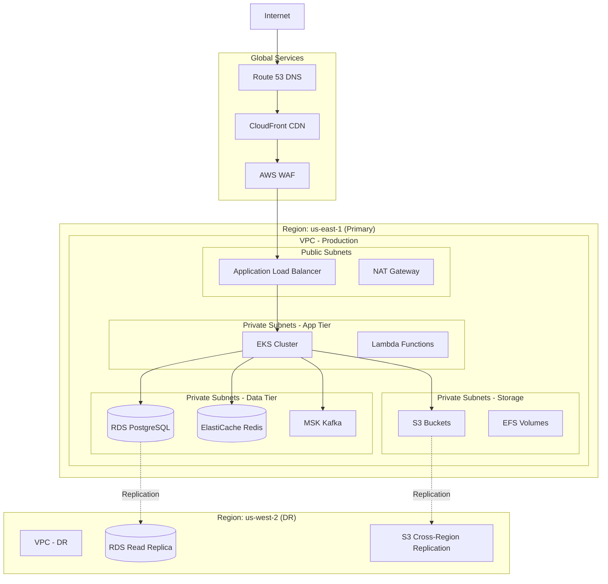

# Deployment & Infrastructure - Healthcare Claim Process

## Overview

This document describes the deployment architecture, cloud infrastructure, and operational procedures for the healthcare claim processing system.

## Cloud Infrastructure (AWS)

### High-Level Infrastructure



### Network Architecture

**VPC Configuration**:
```yaml
VPC:
  CIDR: 10.0.0.0/16
  
  Availability Zones:
    - us-east-1a
    - us-east-1b
    - us-east-1c
  
  Subnets:
    Public:
      - us-east-1a: 10.0.1.0/24
      - us-east-1b: 10.0.2.0/24
      - us-east-1c: 10.0.3.0/24
    
    Private-App:
      - us-east-1a: 10.0.11.0/24
      - us-east-1b: 10.0.12.0/24
      - us-east-1c: 10.0.13.0/24
    
    Private-Data:
      - us-east-1a: 10.0.21.0/24
      - us-east-1b: 10.0.22.0/24
      - us-east-1c: 10.0.23.0/24
  
  Internet Gateway: igw-prod-001
  NAT Gateway: 3 (one per AZ)
  
  Route Tables:
    Public: Internet Gateway
    Private: NAT Gateway
```

**Security Groups**:
```yaml
SecurityGroups:
  ALB:
    Inbound:
      - Port 443, Source: 0.0.0.0/0 (HTTPS)
    Outbound:
      - All traffic to EKS nodes
  
  EKS-Nodes:
    Inbound:
      - Port 443, Source: ALB SG
      - All traffic, Source: EKS-Nodes SG (inter-pod)
    Outbound:
      - All traffic
  
  RDS:
    Inbound:
      - Port 5432, Source: EKS-Nodes SG
    Outbound:
      - None
  
  ElastiCache:
    Inbound:
      - Port 6379, Source: EKS-Nodes SG
    Outbound:
      - None
  
  MSK:
    Inbound:
      - Port 9092, Source: EKS-Nodes SG
    Outbound:
      - All traffic to EKS-Nodes
```

### Compute Layer

#### Amazon EKS (Elastic Kubernetes Service)

**Cluster Configuration**:
```yaml
EKS Cluster: claims-prod
Version: 1.28

Node Groups:
  - Name: system-ng
    Instance Type: t3.large
    Min Size: 3
    Max Size: 6
    Desired: 3
    Labels:
      workload: system
    Taints: []
    
  - Name: app-ng
    Instance Type: c5.2xlarge
    Min Size: 6
    Max Size: 20
    Desired: 6
    Labels:
      workload: application
    Taints: []
    
  - Name: data-ng
    Instance Type: r5.xlarge
    Min Size: 3
    Max Size: 10
    Desired: 3
    Labels:
      workload: data-intensive
    Taints:
      - key: data-intensive
        value: "true"
        effect: NoSchedule

Addons:
  - vpc-cni
  - kube-proxy
  - coredns
  - aws-ebs-csi-driver
  - aws-efs-csi-driver
```

**Kubernetes Resources**:
```yaml
# Claim Intake Service Deployment
apiVersion: apps/v1
kind: Deployment
metadata:
  name: claim-intake-service
  namespace: claims-prod
spec:
  replicas: 6
  selector:
    matchLabels:
      app: claim-intake
  template:
    metadata:
      labels:
        app: claim-intake
        version: v1.2.3
    spec:
      containers:
      - name: claim-intake
        image: 123456789.dkr.ecr.us-east-1.amazonaws.com/claim-intake:v1.2.3
        ports:
        - containerPort: 8080
        resources:
          requests:
            memory: "2Gi"
            cpu: "1000m"
          limits:
            memory: "4Gi"
            cpu: "2000m"
        env:
        - name: DATABASE_URL
          valueFrom:
            secretKeyRef:
              name: db-credentials
              key: url
        livenessProbe:
          httpGet:
            path: /health
            port: 8080
          initialDelaySeconds: 30
          periodSeconds: 10
        readinessProbe:
          httpGet:
            path: /ready
            port: 8080
          initialDelaySeconds: 10
          periodSeconds: 5
        
---
# Horizontal Pod Autoscaler
apiVersion: autoscaling/v2
kind: HorizontalPodAutoscaler
metadata:
  name: claim-intake-hpa
  namespace: claims-prod
spec:
  scaleTargetRef:
    apiVersion: apps/v1
    kind: Deployment
    name: claim-intake-service
  minReplicas: 6
  maxReplicas: 30
  metrics:
  - type: Resource
    resource:
      name: cpu
      target:
        type: Utilization
        averageUtilization: 70
  - type: Resource
    resource:
      name: memory
      target:
        type: Utilization
        averageUtilization: 80
  behavior:
    scaleUp:
      stabilizationWindowSeconds: 60
      policies:
      - type: Percent
        value: 50
        periodSeconds: 60
    scaleDown:
      stabilizationWindowSeconds: 300
      policies:
      - type: Percent
        value: 25
        periodSeconds: 120
```

**Service Mesh (Istio)**:
```yaml
# Istio Virtual Service
apiVersion: networking.istio.io/v1beta1
kind: VirtualService
metadata:
  name: claim-intake
  namespace: claims-prod
spec:
  hosts:
  - claim-intake.claims.svc.cluster.local
  http:
  - match:
    - headers:
        version:
          exact: v2
    route:
    - destination:
        host: claim-intake.claims.svc.cluster.local
        subset: v2
      weight: 100
  - route:
    - destination:
        host: claim-intake.claims.svc.cluster.local
        subset: v1
      weight: 90
    - destination:
        host: claim-intake.claims.svc.cluster.local
        subset: v2
      weight: 10
  timeout: 30s
  retries:
    attempts: 3
    perTryTimeout: 10s
    retryOn: 5xx,reset,connect-failure,refused-stream

---
# Circuit Breaker
apiVersion: networking.istio.io/v1beta1
kind: DestinationRule
metadata:
  name: claim-intake
  namespace: claims-prod
spec:
  host: claim-intake.claims.svc.cluster.local
  trafficPolicy:
    connectionPool:
      tcp:
        maxConnections: 1000
      http:
        http1MaxPendingRequests: 100
        http2MaxRequests: 1000
        maxRequestsPerConnection: 2
    outlierDetection:
      consecutiveErrors: 5
      interval: 30s
      baseEjectionTime: 30s
      maxEjectionPercent: 50
      minHealthPercent: 50
```

#### AWS Lambda

**Use Cases**:
- Event-driven processing
- Scheduled jobs
- Lightweight integrations
- One-time migrations

**Example Lambda**:
```python
# EDI File Processor Lambda
import boto3
import json

def lambda_handler(event, context):
    """
    Triggered when EDI file uploaded to S3
    Parses EDI and publishes to Kafka
    """
    s3 = boto3.client('s3')
    
    # Get file from S3
    bucket = event['Records'][0]['s3']['bucket']['name']
    key = event['Records'][0]['s3']['object']['key']
    
    file_obj = s3.get_object(Bucket=bucket, Key=key)
    edi_content = file_obj['Body'].read()
    
    # Parse EDI
    claims = parse_edi_837(edi_content)
    
    # Publish to Kafka
    for claim in claims:
        publish_to_kafka('claims.received', claim)
    
    # Generate 997 acknowledgment
    ack = generate_997_ack(claims)
    
    # Store ack in S3
    s3.put_object(
        Bucket=bucket,
        Key=f"ack/{key}.997",
        Body=ack
    )
    
    return {
        'statusCode': 200,
        'body': json.dumps(f'Processed {len(claims)} claims')
    }
```

### Data Layer

#### Amazon RDS (PostgreSQL)

**Configuration**:
```yaml
Database: claims-prod
Engine: PostgreSQL 14.9
Instance Class: db.r6g.2xlarge
Storage: 2TB GP3 (Provisioned IOPS: 12000)
Multi-AZ: Yes

Read Replicas:
  - claims-prod-read-1 (us-east-1a)
  - claims-prod-read-2 (us-east-1b)
  - claims-prod-dr (us-west-2) - Cross-region

Backup:
  Automated Backups: 30 days
  Backup Window: 02:00-03:00 EST
  Maintenance Window: Sun 03:00-04:00 EST
  
Point-in-Time Recovery: Enabled
Encryption: KMS (aws/rds key)
Enhanced Monitoring: 60 second intervals

Parameter Group Customizations:
  shared_buffers: 16GB
  effective_cache_size: 48GB
  maintenance_work_mem: 2GB
  checkpoint_completion_target: 0.9
  wal_buffers: 16MB
  default_statistics_target: 100
  random_page_cost: 1.1
  effective_io_concurrency: 200
  work_mem: 20MB
  max_connections: 500
```

**Connection Pooling (PgBouncer)**:
```ini
[databases]
claims = host=claims-prod.xxxxx.us-east-1.rds.amazonaws.com port=5432 dbname=claims

[pgbouncer]
listen_addr = 0.0.0.0
listen_port = 6432
auth_type = md5
auth_file = /etc/pgbouncer/userlist.txt
pool_mode = transaction
max_client_conn = 10000
default_pool_size = 25
max_db_connections = 500
reserve_pool_size = 5
reserve_pool_timeout = 3
server_lifetime = 3600
server_idle_timeout = 600
```

#### Amazon ElastiCache (Redis)

**Configuration**:
```yaml
Cluster: claims-cache-prod
Engine: Redis 7.0
Node Type: cache.r6g.xlarge
Number of Nodes: 3
Cluster Mode: Enabled
Shards: 3
Replicas per Shard: 2

Encryption:
  At-rest: Yes
  In-transit: Yes
  
Backup:
  Automatic Backups: Enabled
  Retention: 7 days
  Backup Window: 03:00-05:00 EST

Parameter Group:
  maxmemory-policy: allkeys-lru
  timeout: 300
  tcp-keepalive: 300
```

#### Amazon MSK (Managed Streaming for Kafka)

**Configuration**:
```yaml
Cluster: claims-kafka-prod
Kafka Version: 3.5.1
Instance Type: kafka.m5.2xlarge
Number of Brokers: 6 (2 per AZ)
Storage per Broker: 1TB EBS

Configuration:
  auto.create.topics.enable: false
  default.replication.factor: 3
  min.insync.replicas: 2
  num.partitions: 12
  compression.type: lz4
  log.retention.hours: 168  # 7 days
  
Security:
  Encryption in-transit: TLS
  Client Authentication: IAM
  
Monitoring:
  Enhanced Monitoring: Enabled
  CloudWatch Logs: Enabled
```

**Kafka Topics**:
```yaml
Topics:
  claims.received:
    Partitions: 24
    Replication Factor: 3
    Retention: 7 days
    
  claims.validated:
    Partitions: 24
    Replication Factor: 3
    Retention: 7 days
    
  claims.adjudicated:
    Partitions: 24
    Replication Factor: 3
    Retention: 7 days
    
  claims.paid:
    Partitions: 12
    Replication Factor: 3
    Retention: 30 days
    
  notifications.outbound:
    Partitions: 12
    Replication Factor: 3
    Retention: 3 days
```

### Storage Layer

#### Amazon S3

**Bucket Structure**:
```
claims-attachments-prod/
  └── {year}/
      └── {month}/
          └── {claim-id}/
              └── attachments/

claims-edi-inbound/
  └── {trading-partner}/
      └── {year}/
          └── {month}/
              └── {day}/

claims-edi-outbound/
  └── {trading-partner}/
      └── {year}/
          └── {month}/
              └── {day}/

claims-documents-prod/
  └── eob/
  └── correspondence/
  └── reports/

claims-backups/
  └── database/
  └── configs/
  └── logs/
```

**Bucket Policies**:
```json
{
  "Version": "2012-10-17",
  "Statement": [
    {
      "Sid": "EnforceSSLOnly",
      "Effect": "Deny",
      "Principal": "*",
      "Action": "s3:*",
      "Resource": [
        "arn:aws:s3:::claims-attachments-prod",
        "arn:aws:s3:::claims-attachments-prod/*"
      ],
      "Condition": {
        "Bool": {
          "aws:SecureTransport": "false"
        }
      }
    },
    {
      "Sid": "EnforceEncryption",
      "Effect": "Deny",
      "Principal": "*",
      "Action": "s3:PutObject",
      "Resource": "arn:aws:s3:::claims-attachments-prod/*",
      "Condition": {
        "StringNotEquals": {
          "s3:x-amz-server-side-encryption": "aws:kms"
        }
      }
    }
  ]
}
```

**Lifecycle Policies**:
```json
{
  "Rules": [
    {
      "Id": "ArchiveOldAttachments",
      "Status": "Enabled",
      "Transitions": [
        {
          "Days": 730,
          "StorageClass": "GLACIER"
        }
      ],
      "Expiration": {
        "Days": 3650
      }
    },
    {
      "Id": "CleanupEDIFiles",
      "Status": "Enabled",
      "Filter": {
        "Prefix": "claims-edi-inbound/"
      },
      "Expiration": {
        "Days": 90
      }
    }
  ]
}
```

## CI/CD Pipeline

### GitFlow Workflow

```
main (production)
  └── release/v1.2.0
        └── develop (integration)
              ├── feature/claim-intake-enhancement
              ├── feature/fraud-detection-ml
              └── bugfix/payment-calculation
```

### GitHub Actions CI/CD

```yaml
# .github/workflows/deploy.yml
name: Deploy to Production

on:
  push:
    branches: [main]

env:
  AWS_REGION: us-east-1
  ECR_REGISTRY: 123456789.dkr.ecr.us-east-1.amazonaws.com
  EKS_CLUSTER: claims-prod

jobs:
  build-and-test:
    runs-on: ubuntu-latest
    steps:
      - uses: actions/checkout@v3
      
      - name: Set up JDK 17
        uses: actions/setup-java@v3
        with:
          java-version: '17'
          distribution: 'temurin'
      
      - name: Cache Maven packages
        uses: actions/cache@v3
        with:
          path: ~/.m2
          key: ${{ runner.os }}-m2-${{ hashFiles('**/pom.xml') }}
      
      - name: Build with Maven
        run: mvn clean package -DskipTests
      
      - name: Run Unit Tests
        run: mvn test
      
      - name: Run Integration Tests
        run: mvn verify -P integration-tests
      
      - name: SonarQube Scan
        run: mvn sonar:sonar
      
      - name: OWASP Dependency Check
        run: mvn dependency-check:check
  
  security-scan:
    needs: build-and-test
    runs-on: ubuntu-latest
    steps:
      - uses: actions/checkout@v3
      
      - name: Run Trivy vulnerability scanner
        uses: aquasecurity/trivy-action@master
        with:
          scan-type: 'fs'
          scan-ref: '.'
          severity: 'CRITICAL,HIGH'
  
  build-image:
    needs: security-scan
    runs-on: ubuntu-latest
    outputs:
      image-tag: ${{ steps.image-tag.outputs.tag }}
    steps:
      - uses: actions/checkout@v3
      
      - name: Generate Image Tag
        id: image-tag
        run: |
          TAG="v$(cat VERSION)-${GITHUB_SHA::8}"
          echo "tag=$TAG" >> $GITHUB_OUTPUT
      
      - name: Configure AWS credentials
        uses: aws-actions/configure-aws-credentials@v2
        with:
          aws-access-key-id: ${{ secrets.AWS_ACCESS_KEY_ID }}
          aws-secret-access-key: ${{ secrets.AWS_SECRET_ACCESS_KEY }}
          aws-region: ${{ env.AWS_REGION }}
      
      - name: Login to Amazon ECR
        id: login-ecr
        uses: aws-actions/amazon-ecr-login@v1
      
      - name: Build Docker image
        run: |
          docker build -t $ECR_REGISTRY/claim-intake:${{ steps.image-tag.outputs.tag }} .
      
      - name: Scan image with Trivy
        run: |
          trivy image --severity CRITICAL,HIGH --exit-code 1 \
            $ECR_REGISTRY/claim-intake:${{ steps.image-tag.outputs.tag }}
      
      - name: Push image to ECR
        run: |
          docker push $ECR_REGISTRY/claim-intake:${{ steps.image-tag.outputs.tag }}
  
  deploy-staging:
    needs: build-image
    runs-on: ubuntu-latest
    environment: staging
    steps:
      - uses: actions/checkout@v3
      
      - name: Deploy to Staging EKS
        run: |
          kubectl set image deployment/claim-intake-service \
            claim-intake=$ECR_REGISTRY/claim-intake:${{ needs.build-image.outputs.image-tag }} \
            -n claims-staging
      
      - name: Wait for rollout
        run: |
          kubectl rollout status deployment/claim-intake-service \
            -n claims-staging --timeout=5m
      
      - name: Run Smoke Tests
        run: |
          ./scripts/smoke-tests.sh staging
  
  deploy-production:
    needs: deploy-staging
    runs-on: ubuntu-latest
    environment: production
    steps:
      - uses: actions/checkout@v3
      
      - name: Deploy to Production EKS (Canary)
        run: |
          # Deploy canary with 10% traffic
          kubectl apply -f k8s/canary-deployment.yaml
          
          # Update image
          kubectl set image deployment/claim-intake-service-canary \
            claim-intake=$ECR_REGISTRY/claim-intake:${{ needs.build-image.outputs.image-tag }} \
            -n claims-prod
      
      - name: Monitor Canary
        run: |
          # Wait 10 minutes and monitor metrics
          sleep 600
          
          # Check error rate
          ERROR_RATE=$(./scripts/check-error-rate.sh canary)
          if [ $ERROR_RATE -gt 5 ]; then
            echo "Canary error rate too high: $ERROR_RATE%"
            exit 1
          fi
      
      - name: Promote to Production
        run: |
          # Update main deployment
          kubectl set image deployment/claim-intake-service \
            claim-intake=$ECR_REGISTRY/claim-intake:${{ needs.build-image.outputs.image-tag }} \
            -n claims-prod
          
          # Wait for rollout
          kubectl rollout status deployment/claim-intake-service \
            -n claims-prod --timeout=10m
          
          # Remove canary
          kubectl delete deployment claim-intake-service-canary -n claims-prod
      
      - name: Notify Slack
        uses: slackapi/slack-github-action@v1
        with:
          payload: |
            {
              "text": "✅ Production deployment successful: ${{ needs.build-image.outputs.image-tag }}"
            }
        env:
          SLACK_WEBHOOK_URL: ${{ secrets.SLACK_WEBHOOK }}
```

### Deployment Strategies

**Blue/Green Deployment**:
```yaml
# Blue (current production)
apiVersion: apps/v1
kind: Deployment
metadata:
  name: claim-intake-blue
  labels:
    version: blue
spec:
  replicas: 10
  ...

---
# Green (new version)
apiVersion: apps/v1
kind: Deployment
metadata:
  name: claim-intake-green
  labels:
    version: green
spec:
  replicas: 10
  ...

---
# Service points to blue
apiVersion: v1
kind: Service
metadata:
  name: claim-intake
spec:
  selector:
    version: blue  # Switch to green after validation
  ...
```

**Canary Deployment (Istio)**:
```yaml
# 90% to stable, 10% to canary
apiVersion: networking.istio.io/v1beta1
kind: VirtualService
metadata:
  name: claim-intake
spec:
  hosts:
  - claim-intake
  http:
  - match:
    - headers:
        canary:
          exact: "true"
    route:
    - destination:
        host: claim-intake
        subset: canary
  - route:
    - destination:
        host: claim-intake
        subset: stable
      weight: 90
    - destination:
        host: claim-intake
        subset: canary
      weight: 10
```

## Monitoring & Observability

### Application Performance Monitoring (Datadog)

**Metrics Collected**:
- Request rate, latency, errors (RED metrics)
- Resource utilization (CPU, memory, disk)
- Database query performance
- Cache hit rates
- Queue depth and lag
- Business metrics (claims processed, payments made)

**Dashboards**:
- System health overview
- Service-specific dashboards
- Database performance
- Business KPIs
- SLA tracking

**Alerts**:
```yaml
Alerts:
  - name: High Error Rate
    condition: error_rate > 5% for 5 minutes
    severity: critical
    notify: pagerduty
  
  - name: High API Latency
    condition: p95_latency > 2s for 10 minutes
    severity: warning
    notify: slack
  
  - name: Database Connection Pool Exhausted
    condition: db_connections > 450 for 2 minutes
    severity: critical
    notify: pagerduty
  
  - name: Kafka Consumer Lag
    condition: consumer_lag > 10000 for 5 minutes
    severity: warning
    notify: slack
```

### Logging (ELK Stack)

**Log Aggregation**:
- Application logs (structured JSON)
- Access logs
- Audit logs
- System logs

**Log Retention**:
- Hot tier (Elasticsearch): 30 days
- Warm tier (S3): 1 year
- Cold tier (Glacier): 7 years

**Log Search**:
```
# Find all errors for a specific claim
claim_id:"CLM-2026-00123456" AND level:"ERROR"

# Find slow database queries
logger:"database" AND duration:>1000

# Find PHI access by user
event_type:"PHI_ACCESS" AND user_id:"john.doe@company.com"
```

### Distributed Tracing (Jaeger)

**Trace Example**:
```
Request ID: req-123456789
Duration: 1.2s

  ├─ API Gateway (50ms)
  ├─ Claim Intake Service (200ms)
  │   ├─ Validate Claim (50ms)
  │   ├─ Store to Database (100ms)
  │   └─ Publish to Kafka (50ms)
  ├─ Validation Service (800ms)
  │   ├─ Check Eligibility (300ms)
  │   │   └─ Cache Miss → Database Query (280ms)
  │   ├─ Check Provider (200ms)
  │   └─ Check Benefits (300ms)
  └─ Adjudication Service (150ms)
```

## Disaster Recovery

### RTO/RPO Targets

| System Component | RTO | RPO |
|-----------------|-----|-----|
| Claim Processing | 1 hour | 5 minutes |
| Member Portal | 30 minutes | 15 minutes |
| Provider Portal | 30 minutes | 15 minutes |
| Reporting | 4 hours | 1 hour |

### DR Procedures

**Scenario: Regional Failure (us-east-1)**

```
1. Detection (0-5 minutes):
   - Automated monitoring detects failure
   - Alert sent to on-call engineer
   - Incident declared (P1)

2. Assessment (5-15 minutes):
   - Confirm scope of outage
   - Check DR site status (us-west-2)
   - Engage DR team

3. Failover (15-45 minutes):
   - Promote RDS read replica to primary (us-west-2)
   - Update DNS to point to DR region
   - Start EKS services in DR region
   - Verify Kafka replication
   - Redirect traffic

4. Validation (45-60 minutes):
   - Test critical paths
   - Verify data integrity
   - Confirm all services operational

5. Communication:
   - Update status page
   - Notify stakeholders
   - Communicate expected restoration
```

---
*Document Version: 1.0*
*Last Updated: January 2026*
*Owner: Platform Engineering Team*
