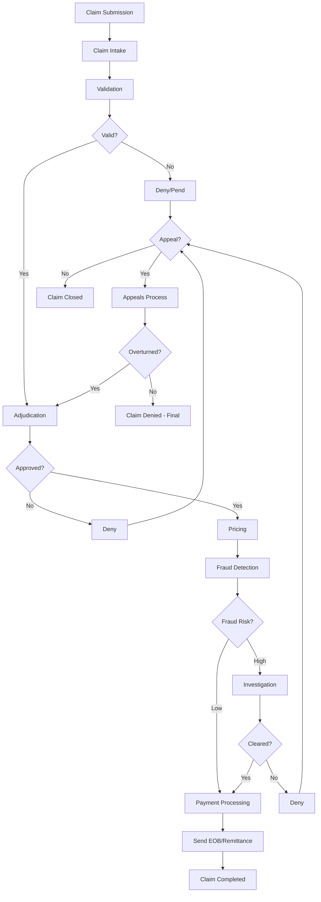
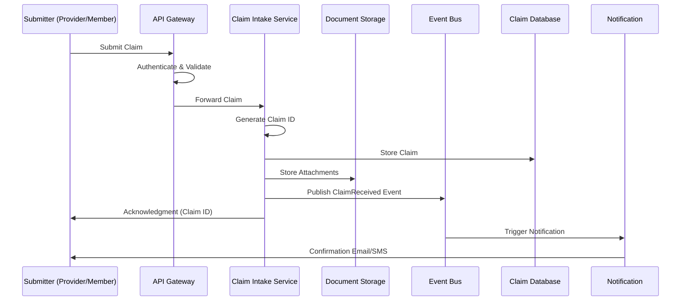
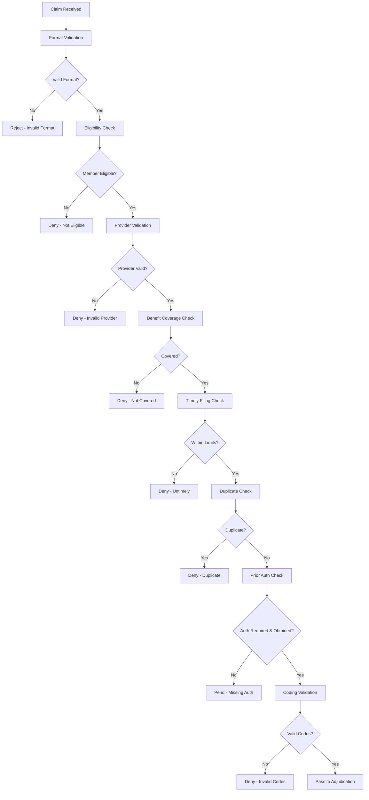
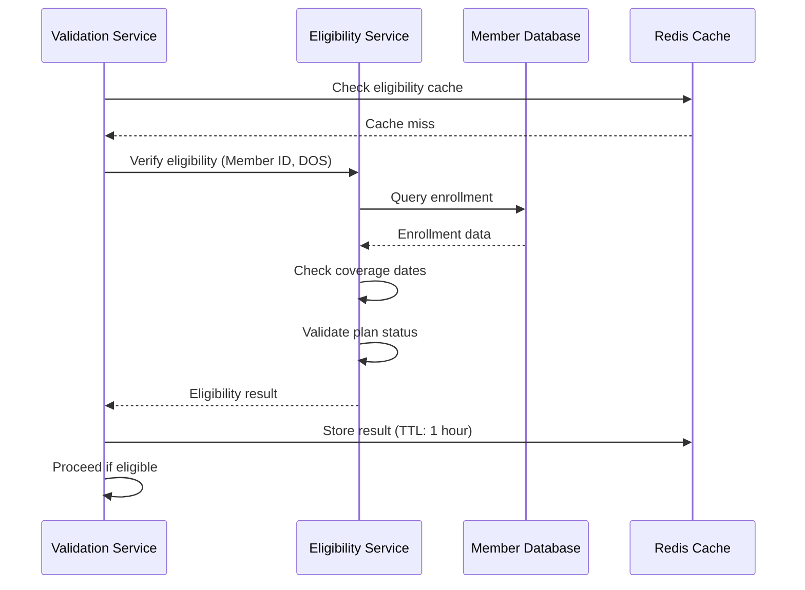
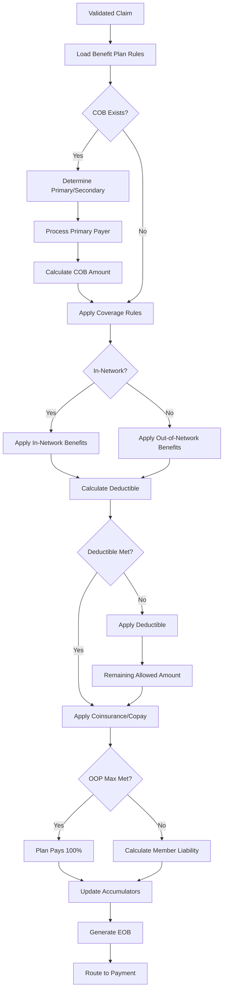
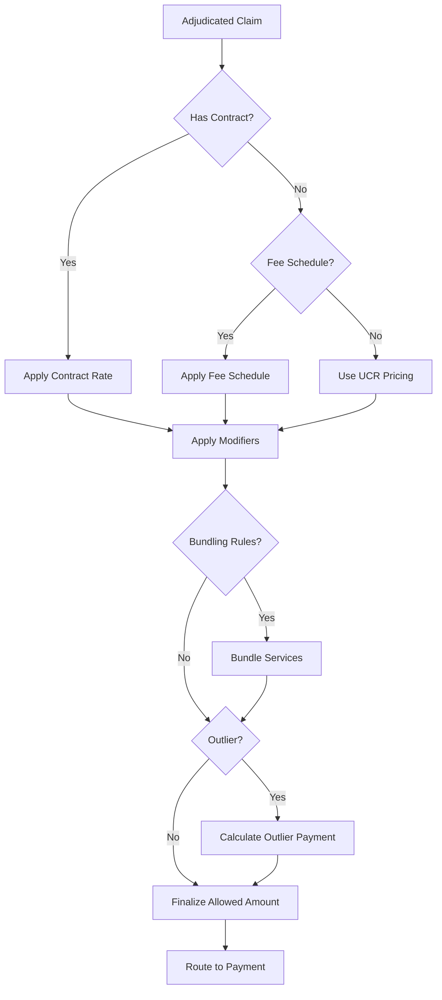
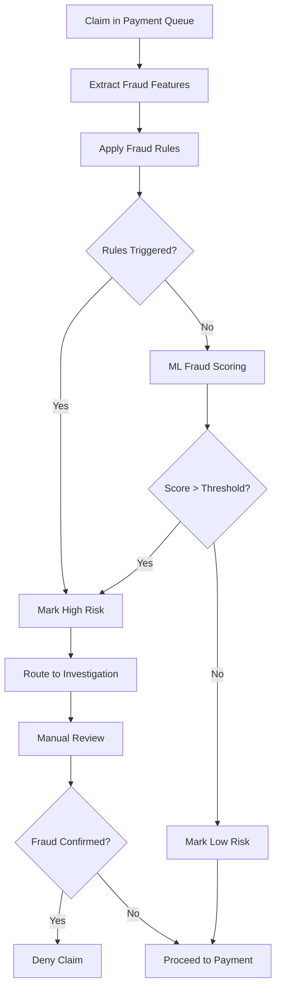
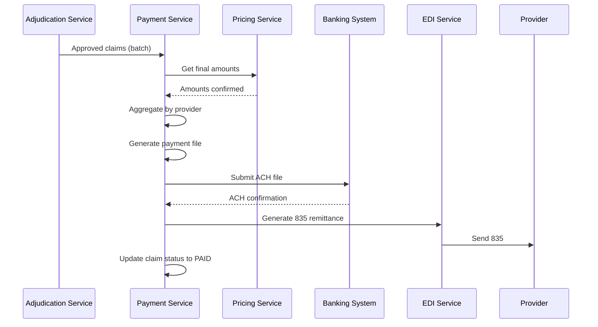
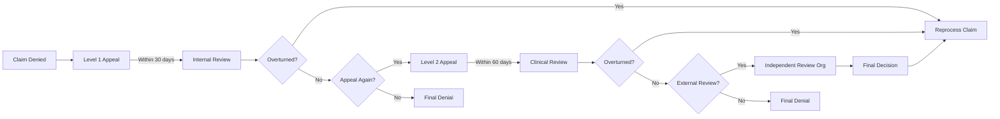

# Claim Process Workflow - Healthcare Payer System

## Overview

This document provides detailed process flows for the end-to-end claim processing workflow in a healthcare payer system. The workflow covers all stages from claim submission through final payment or denial.

## Process Flow Overview



## Detailed Process Flows

### 1. Claim Submission Process

**Actors**: Provider, Member, System

**Channels**:
- EDI (Electronic Data Interchange) - X12 837 transactions
- Provider Portal
- Member Portal
- Mobile App
- Paper Claims (scanned and digitized)
- Fax (OCR processing)

**Process Steps**:



**Submission Methods Details**:

#### EDI Submission (X12 837)
1. Provider submits 837 file to clearinghouse
2. Clearinghouse validates and forwards to payer
3. EDI Gateway receives and parses transaction
4. System generates 997/999 functional acknowledgment
5. Claim data extracted and normalized
6. Claim registered in system

#### Portal Submission
1. Provider/member logs into portal
2. Completes claim form with required fields
3. Uploads supporting documentation
4. Reviews and submits claim
5. Receives immediate confirmation with claim ID
6. Can track claim status in real-time

#### Mobile App Submission
1. Member takes photo of paper bills/receipts
2. OCR extracts data from images
3. Member reviews and confirms extracted data
4. Submits claim through app
5. Receives push notification confirmation

**Data Validation at Intake**:
- Required fields present
- Data format validation
- File size and type validation
- Duplicate submission check (within 24 hours)

**Outcomes**:
- **Success**: Claim ID assigned, acknowledgment sent, routed to validation
- **Rejection**: Missing required data, invalid format, duplicate
- **Pending**: Awaiting additional information

**Timelines**:
- EDI acknowledgment: Within 5 minutes
- Portal/App confirmation: Immediate
- Paper claim processing: 1-3 business days

### 2. Validation Process

**Purpose**: Ensure claim meets all requirements before adjudication.

**Process Steps**:



**Validation Categories**:

#### Format Validation
- HIPAA 5010 compliance
- Required loop and segment validation
- Data element validation
- Syntax validation

**Example Checks**:
- NM1 segment present for subscriber
- Date formats (CCYYMMDD)
- Monetary amounts (max 15 digits)
- Service line count matches header

#### Eligibility Validation


**Eligibility Checks**:
- Member enrolled on date of service
- Coverage active (not terminated)
- Correct plan and benefit package
- Dependent eligibility (if applicable)
- COBRA/continuation coverage status

#### Provider Validation
**Checks**:
- Valid NPI (National Provider Identifier)
- Provider credentialed with payer
- Network participation status (in-network vs. out-of-network)
- Provider specialty matches service
- Rendering vs. billing provider validation
- Facility licensing and accreditation

#### Benefit Coverage Validation
**Checks**:
- Service covered under benefit plan
- Service within benefit limits (e.g., annual maximum)
- Age/gender appropriate service
- Medical necessity criteria
- Exclusions and limitations
- Experimental/investigational services

#### Timely Filing Validation
**Rules**:
- Standard filing limit: 90-180 days from DOS
- Varies by contract and state law
- Corrected claims: Extended timeframe
- Appeals: Separate deadlines

**Calculation**:
```
Filing Deadline = Date of Service + Filing Limit Days
Current Date <= Filing Deadline → Pass
Current Date > Filing Deadline → Deny (untimely filing)
```

#### Duplicate Claim Detection
**Matching Criteria**:
- Member ID
- Provider NPI
- Date of service
- Procedure codes
- Billed amount (within tolerance)

**Outcomes**:
- Exact duplicate: Deny
- Possible duplicate: Pend for review
- Corrected claim: Allow if properly indicated
- Replacement claim: Void original, process new

#### Prior Authorization Validation
**Process**:
1. Check if service requires prior authorization
2. Query authorization system
3. Validate authorization number
4. Check authorization dates
5. Verify units/quantity against authorization
6. Confirm service matches authorized service

**Outcomes**:
- Auth not required: Continue
- Auth obtained and valid: Continue
- Auth required but missing: Pend/Deny
- Auth expired: Pend/Deny

#### Coding Validation
**ICD-10 Diagnosis Validation**:
- Valid ICD-10 code
- Appropriate specificity level
- Diagnosis supports procedure
- Age/gender appropriate diagnosis

**CPT/HCPCS Procedure Validation**:
- Valid procedure code
- Code active on date of service
- Appropriate modifiers
- Units within acceptable range
- Bundling/unbundling rules

**Edits**:
- NCCI (National Correct Coding Initiative) edits
- MUE (Medically Unlikely Edits)
- LCD/NCD (Local/National Coverage Determinations)

**Validation Outcomes**:

| Outcome | Next Step | Timeline |
|---------|-----------|----------|
| **Passed** | Route to adjudication | Immediate |
| **Pended** | Request additional information | 1-3 days |
| **Denied** | Generate denial letter | 1-2 days |
| **Rejected** | Return to submitter | Immediate |

**Performance Metrics**:
- Validation time: < 2 seconds per claim
- Auto-validation rate: > 90%
- False rejection rate: < 1%

### 3. Adjudication Process

**Purpose**: Determine payment amount based on benefit rules and contract terms.

**Process Flow**:



**Detailed Adjudication Steps**:

#### Step 1: Load Benefit Plan
```json
{
  "planId": "HMO-GOLD-2026",
  "networkType": "HMO",
  "deductible": {
    "individual": 1500,
    "family": 3000
  },
  "outOfPocketMax": {
    "individual": 6000,
    "family": 12000
  },
  "coinsurance": {
    "inNetwork": 0.20,
    "outOfNetwork": 0.40
  },
  "copays": {
    "primaryCare": 25,
    "specialist": 50,
    "emergencyRoom": 250
  }
}
```

#### Step 2: Coordination of Benefits (COB)
**Scenarios**:

1. **Dual Coverage (e.g., employee + spouse's plan)**:
   - Determine primary payer (birthday rule for dependents)
   - Primary payer adjudicates first
   - Secondary payer covers remaining (up to their allowed amount)

2. **Medicare + Supplemental**:
   - Medicare primary
   - Supplemental covers copay/deductible

3. **Work-related Injury**:
   - Workers' compensation primary
   - Health insurance not applicable

**COB Calculation Example**:
```
Total Billed: $2,000
Primary Allowed: $1,500
Primary Paid: $1,200
Member Liability from Primary: $300

Secondary Allowed: $1,500
Secondary Calculates: $300 (member liability from primary)
Secondary Pays: $200 (if rules allow)
Final Member Liability: $100
```

#### Step 3: Apply Coverage Determination

**Network Status Impact**:

| Service Type | In-Network | Out-of-Network |
|--------------|------------|----------------|
| Primary Care | 80% after deductible | 60% after deductible |
| Specialist | 80% after deductible | 60% after deductible |
| Hospital | 80% after deductible | 60% after deductible |
| Emergency | 80% after deductible | 80% after deductible |

**Service Categories**:
- **Preventive Care**: 100% covered, no deductible
- **Primary Care**: Copay or coinsurance after deductible
- **Specialty Care**: Higher copay/coinsurance
- **Hospital Services**: Coinsurance after deductible
- **Pharmacy**: Separate benefit (tiered copay structure)

#### Step 4: Deductible Calculation

```python
# Pseudo-code for deductible calculation
def calculate_deductible_application(allowed_amount, deductible_met, deductible_limit):
    deductible_remaining = deductible_limit - deductible_met
    
    if deductible_remaining <= 0:
        # Deductible fully met
        return 0, allowed_amount
    
    deductible_applied = min(allowed_amount, deductible_remaining)
    remaining_amount = allowed_amount - deductible_applied
    
    return deductible_applied, remaining_amount
```

**Example**:
```
Allowed Amount: $1,000
Deductible Limit: $1,500
Deductible Met: $800
Deductible Remaining: $700

Deductible Applied: $700
Amount Subject to Coinsurance: $300
```

#### Step 5: Coinsurance/Copay Application

**Copay (Fixed Amount)**:
```
Service: Office Visit
Copay: $25
Member Pays: $25
Plan Pays: Allowed Amount - $25
```

**Coinsurance (Percentage)**:
```
Allowed Amount: $1,000
Member Coinsurance: 20%
Member Pays: $200
Plan Pays: $800
```

**Combined Deductible + Coinsurance**:
```
Total Allowed: $2,000
Deductible Applied: $500
Remaining: $1,500
Coinsurance (20%): $300
Total Member Pays: $800
Plan Pays: $1,200
```

#### Step 6: Out-of-Pocket Maximum

```python
def check_oop_maximum(current_oop, member_liability, oop_max):
    if current_oop >= oop_max:
        # OOP max met - plan pays 100%
        return 0, allowed_amount
    
    oop_remaining = oop_max - current_oop
    
    if member_liability <= oop_remaining:
        # Member pays calculated amount
        return member_liability
    else:
        # Member pays up to OOP max only
        return oop_remaining
```

**Example**:
```
OOP Max: $6,000
OOP Met: $5,700
Calculated Member Liability: $500
OOP Remaining: $300
Actual Member Pays: $300 (not $500)
Plan Pays: Additional $200 (total coverage increased)
```

#### Step 7: Update Accumulators

**Accumulator Types**:
- Deductible (individual and family)
- Out-of-pocket maximum (individual and family)
- Benefit maximums (annual, lifetime)
- Visit counts (e.g., 20 PT visits per year)
- Service-specific limits

**Accumulator Update**:
```json
{
  "memberId": "M123456",
  "planYear": 2026,
  "accumulators": {
    "deductible": {
      "individual": {
        "limit": 1500,
        "met": 1200,
        "updated": "2026-01-15T10:32:00Z"
      },
      "family": {
        "limit": 3000,
        "met": 2400,
        "updated": "2026-01-15T10:32:00Z"
      }
    },
    "outOfPocket": {
      "individual": {
        "limit": 6000,
        "met": 3400,
        "updated": "2026-01-15T10:32:00Z"
      }
    }
  }
}
```

**Adjudication Decision Codes**:

| Code | Description | Remark Code |
|------|-------------|-------------|
| 1 | Deductible applied | N89 |
| 2 | Coinsurance applied | N90 |
| 3 | Copay applied | N91 |
| 22 | Reduced to maximum allowable | N428 |
| 45 | Charge exceeds fee schedule | N54 |
| 96 | Non-covered service | N130 |
| 97 | Payment adjusted (COB) | N32 |

**Performance Metrics**:
- Auto-adjudication rate: > 85%
- Adjudication time: < 5 seconds
- Accuracy rate: > 99.5%

### 4. Pricing Process

**Purpose**: Apply fee schedules and contract pricing to adjudicated amounts.

**Pricing Methods**:



**Pricing Strategies**:

#### 1. Fee Schedule Pricing
**Medicare Fee Schedule Example**:
```
CPT Code: 99213 (Office Visit)
Geographic Location: New York (Locality 01)
Base RVU: 1.5
Geographic Adjustment: 1.15
Conversion Factor: $34.60

Calculation:
Allowed Amount = 1.5 × 1.15 × $34.60 = $59.69
```

#### 2. Contract Pricing
**Provider Contract Types**:
- **Discount from Billed Charges**: 30% off billed charges
- **Fee Schedule**: Specific rates per CPT code
- **Percentage of Medicare**: 120% of Medicare rates
- **Case Rate**: Fixed amount per case (e.g., DRG)
- **Per Diem**: Daily rate for inpatient stays

**Example**:
```
Billed Charges: $10,000
Contract: 30% discount from billed
Allowed Amount: $7,000

vs.

Contract: Fee Schedule
CPT 99232: $150 (contract rate)
Allowed Amount: $150 (regardless of billed)
```

#### 3. DRG Pricing (Inpatient)
**MS-DRG Calculation**:
```
DRG: 470 - Major Joint Replacement
Base Rate: $5,000
Hospital-specific adjustment: 1.1
Case Mix Index: 1.5
Outlier threshold: $22,000

DRG Payment = $5,000 × 1.1 × 1.5 = $8,250

If total charges > $22,000:
  Outlier Payment = (Charges - Threshold) × 0.8
  Total Payment = DRG Payment + Outlier Payment
```

#### 4. Bundled Payment
**Example - Maternity Bundle**:
```
Services Included:
- Prenatal visits
- Delivery
- Postpartum care

Bundled Rate: $8,000 (regardless of individual service charges)
```

**Modifier Impact**:

| Modifier | Description | Pricing Impact |
|----------|-------------|----------------|
| 26 | Professional component only | Reduce to prof. fee only |
| TC | Technical component only | Reduce to tech. fee only |
| 50 | Bilateral procedure | 150% of base rate |
| 51 | Multiple procedures | 100% + 50% of additional |
| 59 | Distinct procedural service | Allow both procedures |

**Performance Metrics**:
- Pricing accuracy: > 99%
- Contract rate lookup time: < 100ms
- Fee schedule cache hit rate: > 95%

### 5. Fraud Detection Process

**Real-time Fraud Scoring**:



**Fraud Indicators**:

#### Provider-Level Indicators
- Unusual billing patterns
- High volume of specific procedures
- Services not matching specialty
- Billing for deceased patients
- Geographic anomalies
- Upcoding patterns
- Unbundling patterns

#### Member-Level Indicators
- Services from multiple providers same day
- Excessive utilization
- Out-of-area services
- Pattern inconsistent with diagnosis

#### Claim-Level Indicators
- Duplicate claims (different providers)
- Services exceeding medical necessity
- Billing for services not rendered
- Falsified documentation

**Fraud Scoring Model**:
```python
# Features for ML model
features = {
    'provider_volume_percentile': 0.95,  # Top 5% billers
    'diagnosis_procedure_mismatch': 0.8,  # 80% probability
    'geographic_anomaly_score': 0.7,
    'billing_pattern_deviation': 0.85,
    'historical_fraud_rate': 0.02  # 2% of past claims flagged
}

# Model prediction
fraud_probability = ml_model.predict(features)
# Output: 0.75 (75% probability of fraud)

if fraud_probability > 0.7:
    action = "INVESTIGATE"
elif fraud_probability > 0.4:
    action = "REVIEW"
else:
    action = "APPROVE"
```

**Investigation Outcomes**:
- **Confirmed Fraud**: Deny claim, refer to SIU, potential prosecution
- **Abuse**: Pay claim, counsel provider, monitor
- **False Positive**: Pay claim, adjust model

### 6. Payment Processing

**Payment Batching**:



**Payment Methods**:

#### Electronic Funds Transfer (EFT)
- ACH transactions
- Processed daily
- 2-3 day settlement
- No check processing cost
- Preferred method

#### Paper Check
- Printed and mailed
- 5-7 day delivery
- Higher processing cost
- For providers without EFT enrollment

#### Virtual Card
- Single-use credit card number
- Immediate payment
- Rebate revenue for payer
- Growing adoption

**Payment Timing**:

| Claim Type | Target Payment Time |
|------------|---------------------|
| Clean electronic claims | 14-18 days |
| Clean paper claims | 25-30 days |
| Claims requiring review | 30-45 days |
| Appeals | 30-60 days |

**Remittance Advice (835)**:
```
Provider sees for each claim:
- Claim ID
- Member name
- Date of service
- Billed amount: $2,000
- Allowed amount: $1,500
- Deductible: $100
- Coinsurance: $280
- Plan paid: $1,120
- Member responsibility: $380
- Adjustment codes and reasons
```

**Payment Reconciliation**:
1. Daily payment file generation
2. Bank submission
3. Bank confirmation
4. Provider receipt confirmation
5. Monthly reconciliation
6. Exception handling

### 7. Explanation of Benefits (EOB) Generation

**Purpose**: Inform members about claim processing and their financial responsibility.

**EOB Components**:

```
╔═══════════════════════════════════════════════════════════════╗
║              EXPLANATION OF BENEFITS                          ║
╠═══════════════════════════════════════════════════════════════╣
║ Member: John Doe                  Claim #: CLM-2026-00123456  ║
║ Date Processed: 01/15/2026                                    ║
╠═══════════════════════════════════════════════════════════════╣
║ PROVIDER: Dr. Jane Smith                                      ║
║ SERVICE DATE: 01/10/2026                                      ║
║ SERVICE: Office Visit (99213)                                 ║
╠═══════════════════════════════════════════════════════════════╣
║ Amount Billed by Provider:                         $150.00    ║
║ Amount Allowed by Plan:                            $120.00    ║
║ Deductible:                                         $50.00    ║
║ Coinsurance (20%):                                  $14.00    ║
║ Plan Paid:                                          $56.00    ║
╠═══════════════════════════════════════════════════════════════╣
║ YOU MAY OWE PROVIDER:                               $64.00    ║
╠═══════════════════════════════════════════════════════════════╣
║ Year-to-Date Totals:                                          ║
║   Deductible: $800 of $1,500                                  ║
║   Out-of-Pocket: $1,200 of $6,000                             ║
╠═══════════════════════════════════════════════════════════════╣
║ THIS IS NOT A BILL                                            ║
║ Your provider will bill you for any amount you owe            ║
╚═══════════════════════════════════════════════════════════════╝
```

**EOB Delivery Channels**:
- Mail (paper)
- Email (PDF)
- Member portal (online)
- Mobile app

**Performance Metrics**:
- EOB generation: Within 24 hours of payment
- Delivery: Within 5 business days
- Member understanding score: > 70%

### 8. Appeals Process

**Appeal Levels and Timelines**:



**Appeal Reasons**:
- Service not covered
- Medical necessity denied
- Timely filing denied
- Incorrect payment amount
- Out-of-network rate dispute
- Prior authorization denial

**Appeal Submission Methods**:
- Online portal
- Fax
- Mail
- Phone (documented)

**Appeal Processing**:
1. **Receive Appeal**:
   - Log in appeals system
   - Assign case number
   - Acknowledge receipt

2. **Review**:
   - Review original claim
   - Review denial reason
   - Review supporting documentation
   - Clinical review if applicable

3. **Decision**:
   - Uphold denial
   - Overturn and pay
   - Partial overturn

4. **Notification**:
   - Written determination letter
   - Explanation of decision
   - Information on next-level appeals

**Appeal Statistics to Track**:
- Appeal rate: % of denied claims appealed
- Overturn rate: % of appeals overturned
- Average appeal processing time
- Appeal reason distribution

**Performance Metrics**:
- Level 1 turnaround: < 30 days
- Level 2 turnaround: < 30 days
- Compliance with timelines: 100%
- Overturn rate: Track (typically 10-20%)

## Exception Scenarios

### Scenario 1: Claim Requires Additional Information

**Trigger**: Missing documentation for medical necessity

**Process**:
1. Claim pended
2. Request letter sent to provider
3. 30-day response deadline
4. If received: Resume processing
5. If not received: Deny for insufficient information

### Scenario 2: Corrected Claim

**Trigger**: Provider submits corrected claim after original payment

**Process**:
1. Identify as corrected claim (frequency code 7)
2. Void original claim
3. Process corrected claim
4. Calculate payment difference
5. Recover overpayment or issue additional payment

### Scenario 3: Coordination of Benefits Discovery

**Trigger**: Other insurance discovered after payment

**Process**:
1. Identify other insurance
2. Determine correct payment order
3. Recalculate claim
4. Request refund if overpaid
5. Reissue payment if underpaid

### Scenario 4: Overpayment Recovery

**Trigger**: Payment made in error

**Process**:
1. Identify overpayment
2. Send overpayment notice to provider
3. Request refund (voluntary)
4. If not refunded: Offset against future payments
5. If substantial: Demand letter, legal action

## Process Metrics and KPIs

### Volume Metrics
- Claims received per day
- Claims processed per day
- Claims pending
- Claims in each status

### Time Metrics
- Average claim processing time
- Time to first payment
- Aging of pending claims
- Appeal resolution time

### Quality Metrics
- Auto-adjudication rate
- Payment accuracy rate
- Claim rework rate
- Denial rate
- Appeal overturn rate

### Financial Metrics
- Cost per claim processed
- Days in claims payable
- Payment accuracy (over/under)
- Fraud savings

### Customer Satisfaction
- Provider satisfaction scores
- Member satisfaction scores
- Call center inquiry rate
- Portal adoption rate

## Integration Points

### Upstream Systems
- Enrollment system (member data)
- Provider network system (provider data)
- Benefit configuration system
- Prior authorization system

### Downstream Systems
- Payment system
- Financial reporting
- Data warehouse
- Customer service CRM

### External Systems
- EDI clearinghouses
- Banking systems
- Pharmacy benefit managers
- Laboratory systems

---
*Document Version: 1.0*
*Last Updated: January 2026*
*Owner: Business Process Architecture Team*
