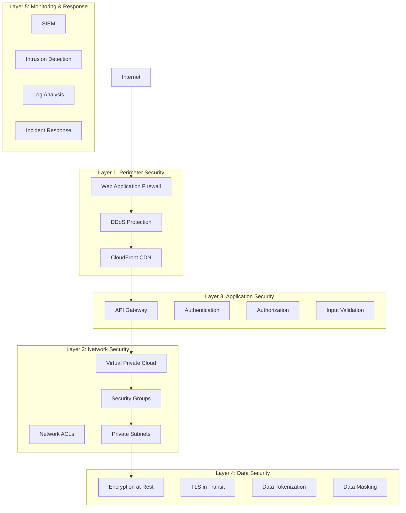
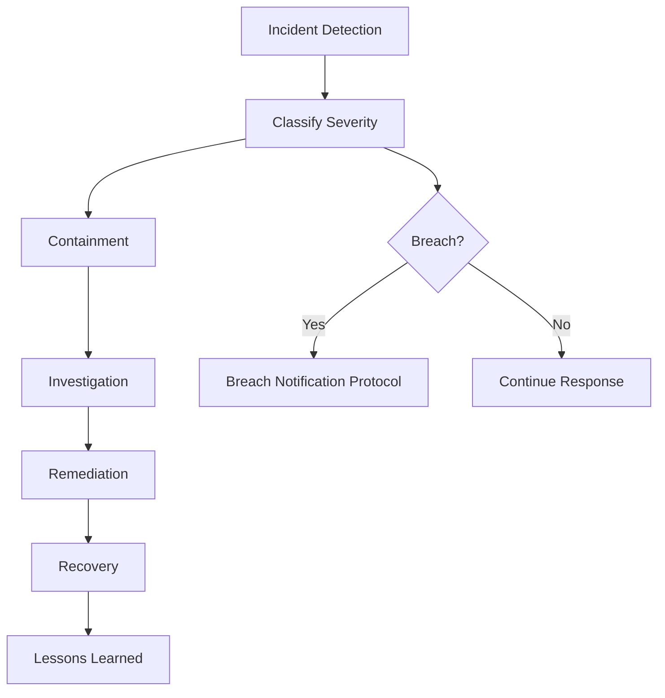

# Security & Compliance Framework - Healthcare Claim Process

## Overview

This document outlines the comprehensive security and compliance framework for the healthcare claim processing system. The framework ensures protection of Protected Health Information (PHI) and compliance with HIPAA, state regulations, and industry standards.

## Security Architecture

### Defense in Depth Strategy



## HIPAA Compliance

### HIPAA Security Rule - Administrative Safeguards

#### 1. Security Management Process

**Risk Analysis**:
- Annual comprehensive risk assessment
- Vulnerability scanning (weekly)
- Penetration testing (quarterly)
- Threat modeling for new features
- Risk register maintenance

**Risk Management**:
- Risk treatment plans
- Security controls implementation
- Regular control effectiveness review
- Continuous monitoring

**Sanction Policy**:
- Clear policies for security violations
- Progressive discipline framework
- Documented sanctions
- Training on policies

**Information System Activity Review**:
- Daily log review
- Weekly security reports
- Monthly trend analysis
- Quarterly executive review

#### 2. Assigned Security Responsibility

**Chief Information Security Officer (CISO)**:
- Overall security program ownership
- Security strategy and governance
- Compliance oversight
- Executive reporting

**Security Operations Team**:
- 24/7 security monitoring
- Incident response
- Vulnerability management
- Security tooling

**Privacy Officer**:
- HIPAA privacy compliance
- Privacy impact assessments
- Member rights requests
- Breach investigation

#### 3. Workforce Security

**Authorization/Supervision**:
```
Role-Based Access Control (RBAC):

Role: Claims Processor
Permissions:
- View claims (all statuses)
- Update claim status
- Add claim notes
- Cannot: Delete claims, modify member data

Role: Member Service Representative
Permissions:
- View member data (read-only)
- View claims for member
- Cannot: Modify claims, access financial data

Role: Claims Auditor
Permissions:
- View all claims
- View all member data
- View payment data
- Cannot: Modify any data
```

**Workforce Clearance**:
- Background checks for all employees
- Credit checks for financial roles
- Drug screening
- Criminal background verification
- Employment verification

**Termination Procedures**:
```
Immediate Actions Upon Termination:
- Disable all system access (within 1 hour)
- Revoke badges and physical access
- Collect company devices
- Disable email and collaboration tools
- Review access logs for anomalies

Within 24 Hours:
- Complete access audit
- Update access control lists
- Notify security team
- Document termination in HR system

Within 7 Days:
- Review any outstanding access
- Close any shared accounts
- Transfer work artifacts
- Complete exit documentation
```

#### 4. Information Access Management

**Access Authorization**:
- Least privilege principle
- Just-in-time access for privileged operations
- Periodic access reviews (quarterly)
- Automatic access expiration

**Access Establishment and Modification**:
```yaml
Access Request Process:
1. Employee submits access request (ServiceNow)
2. Manager approval required
3. Security review for sensitive access
4. Privacy officer approval for PHI access
5. Automated provisioning upon approval
6. Access granted with logging

Access Modification:
- Same approval process
- Additional approval for privilege escalation
- Automatic notification of access changes

Access Review:
- Quarterly automated review
- Manager certification
- Automatic revocation of unused access (90 days)
```

#### 5. Security Awareness and Training

**Training Program**:

| Training Type | Frequency | Audience | Duration |
|--------------|-----------|----------|----------|
| HIPAA Security & Privacy | Annual | All employees | 2 hours |
| Security Awareness | Quarterly | All employees | 30 minutes |
| Phishing Simulation | Monthly | All employees | 10 minutes |
| Developer Security | Annual | Developers | 4 hours |
| Incident Response | Semi-annual | Security team | 4 hours |
| Privacy Training | Annual | PHI access users | 2 hours |

**Training Topics**:
- HIPAA Privacy and Security Rules
- PHI handling procedures
- Password management
- Phishing recognition
- Social engineering awareness
- Incident reporting
- Secure coding practices
- Data classification

#### 6. Security Incident Procedures

**Incident Response Plan**:



**Incident Severity Levels**:

| Level | Description | Response Time | Examples |
|-------|-------------|---------------|----------|
| **P1 - Critical** | PHI breach, system outage | 15 minutes | Data exfiltration, ransomware |
| **P2 - High** | Security compromise, major vulnerability | 1 hour | Unauthorized access, malware |
| **P3 - Medium** | Policy violation, minor vulnerability | 4 hours | Failed authentication, suspicious activity |
| **P4 - Low** | Information-only, minor issues | 24 hours | Security alerts, log anomalies |

**Breach Notification Requirements**:
```
Timeline for HIPAA Breach (affecting 500+ individuals):
- Day 0: Discover breach
- Day 1-3: Assess scope and impact
- Day 4-30: Investigate and contain
- Day 60: Notify affected individuals (by mail)
- Day 60: Notify HHS (via web portal)
- Day 60: Notify media (if 500+ in same state)
- Day 60: Document breach in log

Smaller breaches (<500 individuals):
- Document in breach log
- Annual report to HHS
```

#### 7. Contingency Plan

**Business Continuity**:
- Recovery Time Objective (RTO): 1 hour
- Recovery Point Objective (RPO): 5 minutes
- Annual DR testing
- Documented runbooks
- Failover procedures

**Data Backup Plan**:
```yaml
Backup Strategy:
  Database:
    - Continuous WAL archival (PostgreSQL)
    - Point-in-time recovery capability
    - Daily snapshots (retained 30 days)
    - Weekly full backups (retained 1 year)
    - Monthly backups (retained 10 years)
    
  Object Storage (S3):
    - Versioning enabled
    - Cross-region replication
    - Lifecycle policies for archival
    
  Application Configuration:
    - Version controlled in Git
    - Daily backups
    - Stored in encrypted S3
```

**Disaster Recovery Plan**:
```
Scenario: Primary Data Center Failure

1. Detection (0-5 minutes):
   - Automated monitoring detects failure
   - Alert sent to on-call engineer
   - Incident declared

2. Failover Decision (5-15 minutes):
   - Assess extent of outage
   - Confirm DR site readiness
   - Get executive approval if needed

3. Failover Execution (15-45 minutes):
   - Redirect traffic to DR site
   - Promote read replicas to primary
   - Verify application functionality
   - Update DNS records

4. Validation (45-60 minutes):
   - Test critical workflows
   - Verify data integrity
   - Confirm all services operational

5. Communication:
   - Notify stakeholders
   - Update status page
   - Communicate restoration plan
```

### HIPAA Security Rule - Physical Safeguards

#### 1. Facility Access Controls

**Data Center Security** (AWS):
- SOC 1/SOC 2 certified facilities
- 24/7 security monitoring
- Biometric access controls
- Security guards
- Mantrap entries
- CCTV surveillance

**Office Security**:
- Badge access required
- Visitor logs
- Escort policy for visitors
- Clean desk policy
- Secure disposal of PHI

#### 2. Workstation Use

**Workstation Security Policy**:
```
Requirements:
- Full disk encryption mandatory
- Auto-lock after 5 minutes inactivity
- Complex password required (min 12 characters)
- Antivirus/EDR software required
- VPN required for remote access
- No PHI on local workstations
- Privacy screens for sensitive areas
```

#### 3. Workstation Security

**Device Management**:
- MDM (Mobile Device Management) enrollment
- Remote wipe capability
- OS patch management
- Application whitelisting
- USB port restrictions

#### 4. Device and Media Controls

**Media Disposal**:
```
Hard Drive Disposal:
1. Data wiping (DOD 5220.22-M standard)
2. Physical destruction (shredding)
3. Certificate of destruction
4. Log disposal in asset register

Paper Document Disposal:
1. Shred using cross-cut shredder
2. Use certified shredding service for bulk
3. Certificate of destruction
4. No PHI in regular trash
```

### HIPAA Security Rule - Technical Safeguards

#### 1. Access Control

**Unique User Identification**:
```
User Naming Convention:
- firstname.lastname@company.com
- No shared accounts
- Service accounts: svc-{service-name}
- Unique ID in all audit logs
```

**Emergency Access Procedure**:
```
Break-Glass Access:
1. Emergency account stored in secure vault
2. Requires dual approval to retrieve
3. Temporary time-limited access (4 hours)
4. Full audit logging
5. Automatic notification to security team
6. Post-event review required
```

**Automatic Logoff**:
```
Session Timeouts:
- Web applications: 15 minutes inactivity
- Mobile apps: 5 minutes inactivity
- Admin consoles: 10 minutes inactivity
- SSH sessions: 30 minutes inactivity
```

**Encryption and Decryption**:
```
Encryption Standards:
- At Rest: AES-256
- In Transit: TLS 1.3
- Database: Transparent Data Encryption (TDE)
- Field-level: Application-level encryption for SSN, DOB
- Key Management: AWS KMS with automatic rotation
```

#### 2. Audit Controls

**Audit Logging**:

```json
{
  "timestamp": "2026-01-15T10:32:45.123Z",
  "eventType": "PHI_ACCESS",
  "userId": "john.doe@company.com",
  "ipAddress": "10.0.1.45",
  "action": "READ",
  "resource": "/api/v1/members/M123456",
  "result": "SUCCESS",
  "userAgent": "Mozilla/5.0...",
  "sessionId": "sess-123456",
  "requestId": "req-789012",
  "dataAccessed": {
    "memberId": "M123456",
    "fields": ["firstName", "lastName", "dateOfBirth", "ssn"]
  }
}
```

**Logged Events**:
- All PHI access (read, write, delete)
- Authentication events (login, logout, failed attempts)
- Authorization failures
- Configuration changes
- Privilege escalation
- Data exports
- Account modifications
- System access

**Log Retention**:
- Security logs: 7 years
- PHI access logs: 6 years
- Application logs: 1 year
- Debug logs: 30 days

**Log Protection**:
- Immutable storage (WORM - Write Once Read Many)
- Encrypted at rest
- Restricted access (security team only)
- Integrity verification
- Centralized log management (ELK stack)

#### 3. Integrity Controls

**Data Integrity**:
```sql
-- Database constraints
ALTER TABLE claims ADD CONSTRAINT chk_amounts 
    CHECK (total_paid_amount <= total_allowed_amount);

-- Referential integrity
ALTER TABLE claims ADD CONSTRAINT fk_member 
    FOREIGN KEY (member_id) REFERENCES members(member_id);

-- Audit trail for changes
CREATE TRIGGER audit_claim_changes
    AFTER UPDATE ON claims
    FOR EACH ROW EXECUTE FUNCTION log_change();
```

**Data Validation**:
```python
def validate_claim(claim):
    """Validate claim data integrity"""
    errors = []
    
    # Required fields
    if not claim.member_id:
        errors.append("Member ID required")
    
    # Data types
    if not isinstance(claim.billed_amount, Decimal):
        errors.append("Billed amount must be numeric")
    
    # Business rules
    if claim.service_date_to < claim.service_date_from:
        errors.append("Service end date before start date")
    
    # Checksums
    if not validate_checksum(claim.claim_number):
        errors.append("Invalid claim number checksum")
    
    return errors
```

#### 4. Person or Entity Authentication

**Multi-Factor Authentication (MFA)**:
```
MFA Requirements:
- Required for all users accessing PHI
- Required for admin access
- Required for remote access
- Required for API access (client certificates)

MFA Methods:
- SMS/Text message
- Authenticator app (TOTP)
- Hardware token (YubiKey)
- Biometric (for mobile apps)
```

**Password Policy**:
```yaml
Password Requirements:
  minimum_length: 12
  require_uppercase: true
  require_lowercase: true
  require_number: true
  require_special_char: true
  password_history: 12
  max_age_days: 90
  min_age_days: 1
  max_failed_attempts: 5
  lockout_duration_minutes: 30
  
Password Prohibited:
  - Dictionary words
  - Company name
  - User name
  - Sequential characters (abc, 123)
  - Repeated characters (aaa, 111)
  - Previously breached passwords
```

**Single Sign-On (SSO)**:
```
Identity Provider: Okta
Protocol: SAML 2.0, OpenID Connect
Applications:
- Member Portal
- Provider Portal
- Admin Console
- BI Tools
- Email (Office 365)
- Collaboration tools (Slack)
```

#### 5. Transmission Security

**Network Security**:
```
TLS Configuration:
  minimum_version: "1.3"
  cipher_suites:
    - TLS_AES_256_GCM_SHA384
    - TLS_AES_128_GCM_SHA256
    - TLS_CHACHA20_POLY1305_SHA256
  certificate: "*.healthpayer.com"
  hsts: true
  hsts_max_age: 31536000  # 1 year
```

**VPN Access**:
```
VPN Requirements:
- Required for remote access to internal systems
- Certificate-based authentication
- MFA required
- Full tunnel (no split tunneling for PHI access)
- Automatic disconnection after 8 hours
- AES-256 encryption
```

**API Security**:
```
API Security Controls:
- TLS 1.3 mandatory
- OAuth 2.0 authentication
- JWT tokens (short-lived: 1 hour)
- API key rotation (90 days)
- Rate limiting
- IP whitelisting for sensitive endpoints
- Certificate pinning for mobile apps
```

## Compliance Framework

### Regulatory Compliance

**HIPAA**:
- Privacy Rule compliance
- Security Rule compliance
- Breach Notification Rule compliance
- Omnibus Rule compliance

**State Regulations**:
- State privacy laws (CCPA, etc.)
- State prompt pay laws
- State insurance regulations
- State breach notification laws

**SOC 2 Type II**:
- Security
- Availability
- Confidentiality
- Processing Integrity
- Privacy

**PCI DSS** (for payment card data):
- Level 1 compliance for payment processing
- Quarterly vulnerability scans
- Annual penetration testing
- Secure card data handling

### Compliance Monitoring

**Continuous Compliance**:
```yaml
Automated Compliance Checks:
  Daily:
    - Encryption verification
    - Access control validation
    - Log integrity check
    - Vulnerability scan
  
  Weekly:
    - Access review
    - Configuration compliance
    - Patch compliance
  
  Monthly:
    - User access certification
    - Policy compliance review
    - Control effectiveness testing
  
  Quarterly:
    - Risk assessment update
    - Penetration testing
    - Business continuity testing
    - Vendor security review
  
  Annually:
    - Comprehensive risk assessment
    - HIPAA security assessment
    - SOC 2 audit
    - Policy review and update
```

**Compliance Reporting**:
- Weekly security metrics
- Monthly compliance dashboard
- Quarterly board report
- Annual compliance certification

## Security Operations

### Security Monitoring

**SIEM (Security Information and Event Management)**:
```
Splunk Configuration:
  
Monitored Events:
  - Authentication (success/failure)
  - Authorization failures
  - PHI access
  - Configuration changes
  - Network connections
  - File integrity
  - System errors
  
Correlation Rules:
  - Multiple failed logins → Brute force alert
  - PHI access from unusual location → Alert
  - Large data export → Alert
  - After-hours admin access → Alert
  - Privilege escalation → Alert
  
Alerting:
  - P1: Page on-call engineer
  - P2: Email security team
  - P3: Email and ticket
  - P4: Ticket only
```

### Vulnerability Management

**Vulnerability Scanning**:
```
Scanning Schedule:
  - Infrastructure: Weekly
  - Applications: Weekly
  - Containers: On build
  - Dependencies: Daily (automated)
  
Scanning Tools:
  - Network: Nessus
  - Web Applications: Burp Suite
  - Containers: Trivy
  - Dependencies: Snyk
  - Cloud: AWS Security Hub
```

**Patch Management**:
```
Patching SLA:
  Critical: 7 days
  High: 30 days
  Medium: 90 days
  Low: 180 days
  
Process:
  1. Vulnerability identified
  2. Risk assessment
  3. Patch testing (dev/staging)
  4. Change request (for production)
  5. Deployment (with rollback plan)
  6. Verification
  7. Close ticket
```

### Penetration Testing

**Testing Scope**:
- External network
- Internal network
- Web applications
- Mobile applications
- APIs
- Cloud infrastructure

**Testing Schedule**:
- Quarterly external penetration test
- Annual internal penetration test
- Ad-hoc testing for major releases

**Remediation**:
- Critical findings: 7 days
- High findings: 30 days
- Medium findings: 90 days
- Retest after remediation

## Security Metrics and KPIs

### Key Security Metrics

| Metric | Target | Measurement |
|--------|--------|-------------|
| Mean Time to Detect (MTTD) | < 15 minutes | Time from event to detection |
| Mean Time to Respond (MTTR) | < 1 hour (P1) | Time from detection to containment |
| Phishing Click Rate | < 5% | % of employees clicking phishing simulations |
| Vulnerability Remediation | 100% within SLA | % of vulnerabilities patched on time |
| Failed Login Rate | < 0.1% | Failed authentications / total authentications |
| Security Training Completion | 100% | % of employees completing training |
| Access Review Completion | 100% | % of quarterly reviews completed |
| Encryption Coverage | 100% | % of PHI encrypted |
| Audit Log Completeness | 100% | % of required events logged |
| Incident Response Time | < 15 min (P1) | Time to acknowledge incident |

### Compliance Metrics

| Metric | Target | Measurement |
|--------|--------|-------------|
| HIPAA Violations | 0 | Confirmed violations |
| Breach Incidents | 0 | Reportable breaches |
| Audit Findings | 0 critical | SOC 2 / Internal audit findings |
| Policy Compliance | 100% | % of systems compliant with policies |
| Access Review Completion | 100% | Quarterly access certifications |
| Training Completion | 100% | Employee training compliance |
| Data Retention Compliance | 100% | Data retained per policy |

---
*Document Version: 1.0*
*Last Updated: January 2026*
*Owner: Information Security & Compliance Team*
